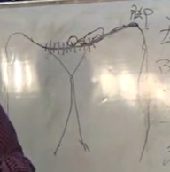
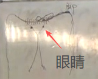

# 培训课程：宗筋疗法

讲师：周嘉荣教授

## 一、中医的根本

大家看的都是病，又不理解什么叫病。比如说我皮肤科看皮肤病，因为整个解剖学都错了。中医学院按解剖学为原理，你错了。说解剖学怎么错了？它解剖出气来没？你整个是气血的运行，你才活着，没有气你怎么活？恰恰解剖学里边没气。那么中医说寒证、大寒证，解剖学解剖得出来吗？解剖不出来吧？什么是寒，什么是风，解剖学有吗？所以解剖学把你误导了。

### 什么是病

说什么是病，那更不清楚了。说你发炎是病，还是长瘤子是病？病，你要有一个具体的解释。什么叫病？你给我下个定义。治病是不是每一个名词都必须有它的定义？什么叫病？一句话，阴阳失衡则为病。很清楚。你不把这个问题搞清楚，你就别说你治病。

### 阴阳

这里边一个关键的问题是什么？不管你的针法有多好、什么有多好，你知道不知道阴阳？《黄帝内经》里写得很清楚：“阴阳者，天地之道也。”不光是中医，只要你是中国人，你要懂中国文化。中国文化最根本的是什么？叫阴阳，天地之道也。

也就是说，一切客观事物和主观思维，都离不开阴阳。它是根本，是万物之纲纪。所有的一切事物，它都是要分阴阳的。你只有理解了阴阳，才能知道物质为什么变化，才能知道人为什么得病。阴阳失衡则为病。

说什么是阴阳？大家不理解。其实很简单。比如我们这灯亮了，是不是阴阳？你是不是有正极和负极？那么正极就是阳，负极就是阴。再比如原子，有原子核和核外电子，那么原子核就是正极，核外电子就是负极，正负就是阴阳。

阴阳，是万物之纲纪。所有的一切物质都是阴阳。你不管采取任何一种中医治疗方法，都是在平衡阴阳。这是不是关键？

你别说你的技法，只要脱离了阴阳，肯定出问题。阴阳，是万物之纲纪，是变化之父母。你身体的好坏，不管你是搞治疗的还是搞养生的，离不开阴阳。离开阴阳了，你就做不了事。

听着很复杂，其实不复杂。中医大夫一看，你是虚证，虚证说完了，谁虚？阴虚还是阳虚？这是关键。所以阴阳是变化之父母。你不是阴虚了，就是阳虚了。它是一种平衡关系：平衡是相对的，不平衡是绝对的。人体自身在调节平衡，你在治病干嘛？你治病就是帮助它调整平衡，帮助它调整阴阳的平衡。所以经上又说，阴阳是变化之父母，生杀之本始。说你是死是活，都在于阴阳。你看中医有两句话，说你亡阴了、亡阳了，这是两种病。亡阴了什么病？就是现在说的干燥症，鼻子干、嘴干、手干、眼睛干……

## 二、阴阳三分法与治病原则

理解这个阴阳，我给它来个阴阳三分法，这样你就能更实际地理解，是让眼睛看得见的理解。那么阴阳三分法怎么分？

### 前后之阴阳

我治病跟别人都不一样。怎么不一样？治病有个大问题。现在都是哪疼治哪，脸有病了，扎好几十针，扎得跟刺猬似的还没好。脸出问题了，不要扎脸，要扎脚。因为中医没有说让你哪疼治哪，它说前病后治、左病右治、上病下治、四肢的病中间治、中间的病四肢治，这是原则一。

原则二：哪个脏器坏了，不治哪个脏器，这样你才能治好。

《黄帝内经》还说了：虚则补其母，实则泻其子。虚的怎么办？说肺坏了，你治肺，治死也治不好。因为你没有找到它的母，也没有找到它的子。

这两大治疗原则。为什么前病后治、后病前治？因为前后分阴阳。你的后背整个是阳，它走的是太阳经，是一身之阳气。后背整个是阳，那么它有一条更主要的经络，就是督脉。

很大一部分人的督脉都是堵塞的。你可以顺着脊柱摸一摸他的督脉，这是走阳气的。当阳气到督脉堵了，阳气就到不了头上，头为诸阳之会，那么头就会不舒服。这条督脉非常重要。

督脉上有两大要点。哪两大要点？一个是大椎穴。你看很多人，尤其是血压高的病人，是不是大椎这点鼓个大包？督脉不通，就堵在这儿了，顶在大椎穴，上不了头。

还有一个是八髎穴，这是督脉堵塞的两大要点，很关键。还得说说，大椎穴堵了，不要治大椎，你治八髎穴；八髎堵了，你就治大椎。这两大要点是互相联系的。

当时我的病人，脖子大椎这里皮炎非常厉害。他说大夫我这怎么办？我让小胡给他八髎穴放血，血一放出来，上面的皮一下就没了。就这么快。治病治对地方，马上就好。

所以用八髎穴治大椎。你看董氏奇穴里有个穴，在尾骨、八髎穴的下边一点，叫什么？叫冲宵穴。这个穴治后头痛，下治上。

女子痛经，治八髎去。你可以八髎穴放血，可以八髎穴扎针，还可以搓八髎，点长强，补肾壮阳。搓到什么地步？搓到小腹发热。你看看，它还通便呢。这就是前病后治。一，八髎治小腹；那么前面是什么？当后边有病了，治谁？治前边。前面的要穴是曲骨穴、膻中穴，这是任脉容易堵的两个点。

所以这是前后之阴阳。前面主阴，后边主阳，那么你这病，看是治阴还是治阳，不一样。前后之阴阳清楚了，你就具体化、简单化。前病后治，后病前治。再分第二，你要知道上下之阴阳。

### 上下之阴阳

上下之阴阳。怎么叫上下之阴阳？从哪儿分？天枢穴。天枢穴分上下，上为阳，下为阴。你看太极图，两个鱼儿在转，在互相变化，阴极生阳，阳极生阴。前面是阴没错，它还得分上下。

天枢穴以上，阳气有一个总穴叫水分穴；天枢穴以下，阴气有一个总穴叫阴交穴。所以为什么让你上病下治、下病上治？刚才我说了，上焦的火，要用下焦的水去给它浇一浇就灭。明白吧？水分、阴交都在肚脐上下。

所以上下之分更重要。上边记住是热，下边是寒。那么下边的寒怎么治？你要用上面的火去暖一下。所以治肾不治肾，你要治心，因为心是最热的。我后边教你两种方法，一种叫宗筋疗法，一种叫脉疗法。

你要用上边的热去下边的寒，用下边的水去上边的热，这样你治病就治对了。对上下之阴阳，你看你凉，是不是腿凉？寒凉在下边，因为冷水重，天生往下沉。那么你热在哪儿？热全在上面，眼睛热、鼻子热、嘴热，都是这个现象，因为热汽轻，天生往上升。

这是热证。那么治热证，大家一般的方法都是在上边卸热，是不是？你没想到它是阴阳不合。所以你脸上那些疙瘩为什么老不下去，痤疮，吃点药、去火下去了，过两天你不吃药又起来了。你用的全是凉药，这火你永远压不掉，它是上热下寒，不能循环，结果卡在天枢穴。所以你必须把下边的寒给它撤掉，把火引火归元，引到肾上，它脸上就不起疙瘩。

我曾经治一个小孩，十五岁，满脸疙瘩，可厉害了。我揉哪儿？揉肚子、揉大腿，天枢以上一点没动。就是从肚子、大腿治他的病。揉了两次，好了，连印儿都不留。这就是上病下治，去的是下身的寒，而不是去治他的火。

这就说明上下之阴阳很重要。因为大家全是理解性错误。火嘛，拿点水浇一浇，那个外借的水不行，去火的方法不对，轻的、浅的可以，越严重你越去不掉。对面部美容这块，大家都整错了。其实很简单，下边治，不治上边，治天枢以下，不要动天枢以上。所以天枢穴区分上下之阴阳。

### 左右之阴阳

第三，是左右之阴阳。如果你不理解左右之阴阳，你就不知道什么叫半身不遂。他为什么半身不遂？人左边半身不遂、人右边半身不遂，怎么回事？左右是怎么回事？左升右降。

你看过黄元御的《四圣心源》，你就会充分理解这个问题。脾为阴，脾气升则化阴为阳。脾气升之后，首先牵动肝，引燃肝火；肝火再生心火。脾胃是一个轴，上边是火，这是一个圆；中为脾土，这是让它提升上来，它带动的是木和火。

胃降，胃是由阳来化阴，将首先到肺，肺主宣发肃降，然后降下来，成为寒水。所以叫脾升胃降。你就知道什么是半身不遂。

有句俗话叫左瘫右痪。所以左边半身不遂不好治，要比右边难治。左为阳，阳气上升，他阳气都升不上来了，这个病就严重了。右侧半身不遂叫右痪，就是他能走，胳膊弯着，还一瘸一拐能走。这叫痪，它是阴气不降，要比阳气不生好治。

左右阴阳也非常重要。在治疗当中，病人就会告诉你，我右膝盖痛，是谁不好？是胃不好。你在治膝盖痛的同时，要治他的胃。如果他是左膝盖痛，在治疗膝盖痛的同时，要治他的脾。

一条经络上十几个穴位，选哪个穴位治？不会选穴，就治它的原穴。十二经有十二原。当然，五腧穴井、荥、俞、经、合你要会治的话，那就更好；不会，就用原穴。左右之阴阳一样非常重要，记住左升右降。

我现在今天主要是讲中医疗法，明天开始讲落脏。首先你要会看病。你都不知道这病是怎么回事、归谁管，你就不会知道是谁。要把病落实到脏腑上。一切疾病源于五脏，所有疾病源于阴阳。阴阳你先懂了，然后我再给你落藏。落完藏，咱们再说治法。治法就是五行的应用，讲的是生化制克的关系。否则的话，这个病你不知道是谁，你就不好治。

这就是阴阳三分法，大家听明白了吗？就是前后之阴阳、上下之阴阳、左右之阴阳。前后阴阳大家都非常清楚，说任督二脉；上下就有一半人知道，一半人不知道。

## 三、气血

再一个，气血的问题。气血其实还是阴阳。气为阳，血为阴。那么最主要的是谁？气，气为血帅。气的主管是肾，肾气是最主要的，肾是一个泵，是气动的，推动浑身气血运行。

所以百分之八九十的病都是由于肾引起的。不管是血压高也好、心脏病也好、糖尿病也好、脑血栓也好，主要的问题大都在肾。你得找到这根儿，你不治根，是错的，你治的只是现象，而没有治根本。肾特别重要，肾为人先天之本。也就是肾和心的问题，一切疾病，都是由于它们俩不好之后才引起其他方面的问题。

治病必求其本。本就是阴阳，是气血。气非常重要。气的毛病就是滞。气滞，气堵塞和瘀滞，这时候它就会有症状表现，你就该治了。扁鹊说，你病在肌肤，你气血瘀滞，这会儿特别好治，一通就好。但是百分之九十的病，在气滞的阶段都得不到治疗。因为你不会发现。比如说我后背有点疼，不很厉害，活动两天又好了。像这样的病，你就不会注意，你没认为你有病。所以说什么叫“不治已病治未病”，他们都理解错了。累就是病，只不过是病的前期反应而已，得不到你的重视而已。当气滞到一定程度，时间久了，气化痰并入腠理了，你就会有比较突出的反应了。

这个痰不是我们吐的痰，它是讲你血液和体液的黏稠程度，叫痰湿。比如说痰湿在脾上，你就会腿沉，严重了肚子发胀，头痛如裹，这就是脾湿的一个特殊表现形式。

很多病人，我一治，我说你腿沉。他说我腿不沉。我说，你现在是不是很少逛街？他说是，我懒得去。这就已经是腿沉了。很多人一回家往沙发上一坐就不动了。这都是腿沉的表现，但你感觉不到，要严重了你才感觉到腿沉，沉得跟灌了铅似的，走五十米就得坐下。这时候你脾的运化功能已经很差。

脾湿了，吃药：二妙丸，吃点就好。还有很多的方法。脑血栓在中医里边叫什么？叫痰瘀，它是血液的黏稠。这个痰到了心脏，叫痰迷心窍。抑郁症、心慌、烦躁，吃抑郁症的药，吃了之后不躁了、不烦了，那是浇水镇压，没有彻底，你要把这痰化了。有一个中成药叫礞石滚痰丸，这是治痰的。这痰黏糊糊的，不好化，得用气来行它，是因为你的气不足了，推动不了了，所以它才产生痰。你理解这个道理，才能知道它是怎么回事。

当痰多了之后，它在你的身体这些管道里运行速度缓慢，就会摩擦生热。痰多了，最后痰化热。热空气上升，冷空气下降，热往上边走，所以这就是脑血栓、脑淤血的根本原因。现在治脑血栓、脑淤血，都是用溶栓的药给你打吊针，溶完之后，过上一段时间又栓了，二次脑血栓、三次脑血栓。它治的是标，不是本。本是什么？是内热。

所以当你要脑血栓或者脑血栓之后，你一定要吃一丸安宫牛黄丸。安宫牛黄是什么？大凉药。牛黄是凉的，犀角、冰片、麝香等等这些药，都是把这个热去掉。如果你马上要脑血栓，一丸安宫牛黄下去，别去医院，它就得好。但是你吃安宫牛黄要注意，药丸外面包的金箔，要吃下去，不要把它扔了。很多人吃那药，都把里头那金箔扔了。去内热最好的药就是金子。

鱼生火，肉生痰。现在的人老吃肉，所以现在脑血栓病人非常多。肉生痰，痰湿产生内热，所以脑血栓这个热一定要去掉。

有一个方法很简单，平常你要多吃点大黄，就这么简单。热消磨掉了，它也没得脑血栓。

痰再转化为毒，就成了癌了。

这个病，你首先知道它的根源，再去判断是谁出问题了。你说我揉这肉，病就好了，对，你动肉的同时，动的是里边的气血，肉只是载体。所以治病治的是气。尤其是按摩，不管你捏哪儿，行的都是气血，都是让气血更好地运行。

## 四、按摩导引术

按摩的全称叫按摩导引术。导引的是什么？气。你不理解气，你就不会治病。你扎针、按摩、放血，行的都是气。

按摩什么病都治，尤其是现在所谓的内科病。不是说只是胳膊疼、腿疼，那只是一小部分。按摩真的什么病都能治。

有这么两句话说得好：手到病除，妙手回春。回春是什么？把死人救活了，不是真正的死人。

我二十年前就体会过这句话。那时候我刚搞按摩没几年。一个老太太坐骨神经痛，她吃了七八天药了，打针、拔罐、按摩通通做过，就是哪疼治哪，整个屁股蛋子全都黑紫了，拔罐拔的。可她还是疼。她在床上跪了七天七夜，只有这个姿势，痛得轻一点，俩胳膊肘在床上，其他哪都不能动，也不能躺、不能站、不能坐。正赶上大春节，大年初三还是初四，她侄女把我请来。我没治过坐骨神经痛，因为我学完医出来治的多是哮喘、牛皮癣。我就开始摸索。摸索什么？摸索足底。我足底做得还比较好，是最早学的东西。足底没找到开关。后来我想起我师爷用过那么一招，我就在她同侧肩上那么一摸，叫痛，就是它。后来我给起一名儿，叫“肩中带”，那是第一次用。点上之后，她就说一股热流唰地顺着下去，一直到她那痛点上，然后又一热，接着又往下走，一直走到脚上。两分钟，不痛了。这就叫什么？手到病除。

我说这个按摩就是找开关。治这个病老不管用，是你没找到那个开关。很简单，你找着那个开关，你“嘣”一摁它就亮了；你找不着开关，你把墙摁个窟窿，它也不亮，就是这个道理。

后来我还做过一个人，胳膊腿都非常好，就只是要这么举着手才不痛，晚上睡觉也疼。我给他做了五次，他能睡觉了，但是还是疼，只是缓解、减轻，不彻底。后来第五次我给他做完了，我说你起来，我看他一眼，我说你过来。我就在他这胸前云门一点，他就说一股热流唰一下就串下去，好了。找到开关了。我做五次没找着开关，这就是开关，一点就好。

还有一个老太太，胸疼、胸闷，不但疼闷，而且气短，根本不能直起腰背。吃了一年的中药，还是没好，还头晕。是我一个徒弟给他弄到我这儿的。那徒弟也很棒，开药一次两千，他吃了半年药没好，后来他说找我师傅去。老太太就来了。之后我就坐在那儿，她站着。我一看，我说你过来，把背转过来，在她后背心俞穴附近有一个黑黑的气团。我把那儿揉一揉，黑气团揉散了，腰马上直起来了，胸也不疼了，气也不短了，头也不晕了。就是那么快。这是我手到病除体会最深的一次。

所以治哪儿很关键。后边我跟你讲落脏，就是要找开关，这是关键。治起来很好治，只要你找到这一点，点到就好。

关于妙手回春，我没做过，我一个同学做过。我就教了他一招，至阳穴。结果他救了一个老头。因为他到农村去，正好碰见一个老头心脏病，当时就不行了。之后他想起我这招来了，他说我用了一下你这个妙手回春，就在至阳穴揉了几分钟，老头就缓过来了。他不是专业做按摩的，所以力度、层次都没达到，所以用了几分钟，达到的话，一分钟之内就能让病人活过来。至阳穴非常重要，是妙手回春的穴位。

## 五、按摩的方法

### 皮疗法

皮疗法治的是什么？以肺为主。肺主皮毛，所以你通过皮来治病，治的是肺病。有这么三种。

1. 捏皮法

原来北京有个杨正风，他就搞捏皮法。他用捏皮法治什么？风湿。治疗风湿以谁为主？以后背为主。他把后背划分为五个区域（就是按内脏的分布和俞穴的分布划分的），中间、两边都有分区。它以后背的皮为主。

知道小儿捏脊吧？跟那个差不太多。大人的话，他是从中间督脉尾椎捏到脖子，从下捏到上三趟，然后膀胱经这边三道，那边膀胱经再三道。以后背为主，其他地方的皮都要捏，顺着经络捏。

头皮也可以捏，这叫捏皮法。当你捏的时候，你会感觉到皮肤的硬度不同。有人后背的皮硬得跟铁板似的。他把皮的硬度分了度，一度、二度、三度、四度到五度。五度就不治了，因为用皮来治的话就很慢。

当你捏后背的时候，你会发现最容易硬的一块，就是脾胃和肾。有人是肝部硬，上面是肺部，所以它是分区的，捏起来是不一样的。

最早我就用捏皮法，治疗疾病特别快，但是有一个毛病：不去根儿。因为你治的是皮、治的是肺，所以它特别快。《内经》上讲“百病起于皮”，扁鹊说“病在肌肤”。当你学各种方法，它都有治疗范围，你都要学。为什么？因为你要用它的特效。哪种方法治疗哪种疾病特效，你就用那种方法。

2. 擦皮法

擦皮法的要领是轻，很轻很轻。在皮肤表面，轻轻地擦，因为行的是气，越轻越好。全身的皮肤都要擦到，就是要耐心。一个小孩得了鼻癌，医者推荐妈妈用擦皮法给孩子治疗，擦了三个月，治好了。

3. 拍打法

拍打法，打哪里？心肺有邪，沉于两肘。肝上有邪，沉于两腋。多多拍打两肘和两腋，能让心肺和肝的邪尽快运行出去。脾上有邪，沉于两胯。胖人想减肥，你就打他的胯，很疼。肾上有邪，沉于两腘，在腘窝处拍打。我曾经治一病人，他腰疼。我的手法非常厉害，八九成的腰疼到我手里很快就能好。结果我给这人治了十次还没好，我很郁闷。第十次治完还没好，我叫他趴下。我就在他腘窝处一拍，当时腰就不疼了。

所以你得看他是什么原因引起的腰痛，不同的腰痛治法是不同的。所以为什么我们要知道五脏的治法。你要针对不同的病，用不同的方法。

拍打法也很厉害。原来我学的就是葛长海的捏筋拍打法。捏筋拍打用什么拍？用木头拍子拍。拍完身上以后，都是治皮，都是以后背为主，后背膀胱经非常重要。拍打法很好用。

### 肉疗法

肉疗法治的是谁？治脾。最突出的是治什么病？糖尿病。糖尿病最好治了。怎么治？捏他的肉。捏哪儿的肉？哪儿肉多捏哪儿，你就捏他的肉就行了。因为脾主肌肉。捏肉就是在治脾。

因为你肌肉得不到运动，所以得糖尿病，《经》云，久坐伤肉劳于脾。你要让肉运动，脾的消化功能就会提高。所以捏肉这个肉疗法，我是在看中央十频道播的一个人，叫宋文喜，他搞按摩的。他一上手，我就发现肉疗法找到了：他是双手往起拿，拿的是肉，既不是皮，也不是筋，所以他这种拿法拿的是肉。

他拿肉的方法，当时讲了三个案例。一个病人是心肺病，一个老记者，心肺病卧床不起半年。本来还能下地，后来在 301 医院住了半年，出院之后就起不来床了，弄到家去，在家又躺了半年。后来不知道怎么找到这个宋文喜，给他揉了一个星期就能下地了，揉两个星期老头跑出去玩了。

然后他又治了一个老年痴呆，用了五次就把老年痴呆整明白了。当场还表演一个治糖尿病，治前测血糖 8.67，让他拿了一遍大约二十分钟，再测血糖 6.4。他就做到这个程度，效果相当好。这就是它的特效，它对糖尿病最好。

以前没有肉疗，宋文喜才三十多岁，很有前程，相当不错，他的主攻方向就是拿肉，一定要有一个专攻。能五次把老年痴呆治好，可见肉疗法很管用。

### 骨疗法

骨疗法治的是谁？是肾。骨与骨之间，是不是里头有筋膜？它有润滑的液体。我说的骨疗法不是光整一块，它是浑身的骨骼都要活动。

比如说，我当时有一个徒弟就是搞骨疗法的。一个病人腕子疼，手腕子疼，他转到某个角度的时候疼。什么原因？是腕骨之间有八块骨头，在某一块骨头和骨头中间粘连。他在某一个动作上疼。我给揉了十次不好，后来我那徒弟说师傅我来吧，他就把这人手腕子摁在这儿，过了一分钟，一个方向分开一下就好了，它就是把那粘连给烧开。所以这八块骨头之间的粘连，叫八面风手法，它有八个方向。你得知道它是哪个方向受损，然后给它走开，各个环节全可以错动。

这就是肾，所以这方面也有很多病，是由于肾引起的关节疼痛、骨骼之间的粘连，所以必须用骨疗法。你用别的疗法就不管用了。

人家是专门搞骨疗法的。那他怎么当我徒弟了？就因为有一个病他治不好。什么病？肩周炎。肩周炎他没法错，一错，这人能疼死。后来正好碰见一个肩周炎，两年抬不起胳膊。他说谁能让这人抬起胳膊来？谁就是我师傅。我说好，你让他躺下。我在他大腿上点了一个穴位，胳膊抬起来了，于是他磕头拜师。为什么胳膊抬不起来？你得知道他病的机理。为什么叫五十肩？到五十岁的时候，你才气血衰败。它是肝和肾不好。你看它是骨和骨之间，骨就是肾，那么旁边的筋就归肝管。他两年抬不起胳膊，其实身体内部已经修复了，就只那一点气血还没通，外力点一下，气血一通，立即就好了。

### 脉疗法

1. 心脑血管疾病

脉疗法对心脑血管疾病非常好用。我教的一个是宗筋疗法，还有一个很主要的就是脉疗法，这是两大技法。

脖子上是什么？都是血管。那你揉脖子，主要是心脑血管疾病。你看心和脑它中间是什么？我说这叫“卡脖工程”。你的心脏不好、你的脑不好，都是堵塞在这儿。现在医学搞什么？检查一下脖子上的血管，你这里头有斑块，或者这点狭窄了，问题都出在脖子上。

当脖子堵塞之后，你的脑供血就出问题了。所以揉脖子，我搞到今年是第五年，研究了五年。教我的那个人，是专门揉脖子的大师。我说你怎么治病？他说我揉脖子。我恍然大悟。我哪儿都揉到了，净摸脖子后边，没摸脖子前边。

再一个从中医上讲，头为诸阳之会。你所有的阳气都要升上来到头，升到脖子，这儿都给你卡住了，你还怎么会好？

2. 肝心肾病（眼睛干涩、见风流泪、妇科病、子宫肌瘤、卵巢囊肿、浑身痛、膝盖痛、脚腕肿疼、下火）

揉脖子都治什么病？治的病可多了。下午实操我给你做脖子。中间喉咙两侧，这点是治肾，因为肾经从这儿走下来，这是肾。右侧这边是肝，左侧治心。

在右侧上边有一点疼，眼睛就会有不舒服的感觉，发干。这里一摸就知道他眼睛发干。我给它揉，把这个结揉开，它马上就不干了，非常快。眼睛见风流泪、眼睛干涩等等，都很快。你生气了，它都堵在这儿。所以这点一按一揉，眼睛立刻就舒服了，不干涩了。

你说左边这儿，我一摸就知道你长子宫肌瘤、卵巢囊肿。上次我一病人说妇科问题，下身痒、干燥，非常难受。后来躺下我揉脖子，揉了二十分钟，下身不痒了，全舒服了。

为什么揉脖子治妇科病？这边是肝，女子以肝为本，这是第一。第二，下身痒痒是谁的问题？心。诸痛痒疮源于心，所以把这一揉开了，就不痒了。这个脖子，这边是心。

我那山东营有一个学员，后来有一次碰到一个风湿性心脏病，浑身疼，没有一个地儿不疼，一个多月了，到处吃药看病、扎针，都治不好。上我这学员这来了。虽然只是开个私人门诊，他就揉他脖子，揉了有二十多分钟，光揉脖子，揉完了浑身哪都不疼。

揉脖子治心脏非常好，下火很快。那你看，揉脖子，膝盖痛、脚腕疼，有时候都是心脏病。膝盖疼，百分之五十都是心脏病的前兆，它是心脏病的前期反应，别小看膝盖疼。脚不肿、腿不肿，就腕子那块肿，那也是心脏病。

很多病揉脖子都行。当然那天就来一电话，说我甲状腺结节、都是脖子这块病，然后我揉脖子揉完了，又拉又吐头又晕。我说那是你治错了，我这是治脚的，不是治脖子的。你那脖子上长东西，得从下边治。我说的是膝盖疼、脚腕肿，用脖子治。

下病上治。那么上面的病怎么办？下面治。你长了甲状腺结节，你在太冲放点血，它很快就好。这得说它是哪个病，怎么治。脖子治病的方面很多，效果都很奇特。

3. 胃病

治胃不治胃，你要治心。不是胃，是心包。心包与胃别通，揉脖子就可以。对脖子，我给它放了一个重点。

### 提博气疗法

听说过这方法吗？提博气。是回族内部治疗疾病的一种方法，就是提肚脐。肚脐是正中的，你从这儿可以感觉到肾间动气。它歪了、偏了，它偏到哪边，你能感觉到。把它提回正中。这个方法非常好，对脑部疾病特别好。

马老师就是把脑癌的小孩，脑瘤，确定是癌，十几岁，他用了十七次就把它排正了。它好在什么地方？在于肾间动气。你看看《难经》第八，什么叫肾间动气？实际上提博气治的是肾。它为什么治脑子好？肾主脑。后边我会讲治脑三法，怎么治头部的疾病，有三种方法。

::: tip 植物人的治疗案例
举一个案例，江西学员高顺金。他不是大夫，就是一个白丁，没系统学过中医。他学了奇针，然后又学完我宗筋，是我第一期学员。学完了回去，不到一个月给我打一个电话：老师，植物人能治不？

我就说，一听就知道你不是大夫，要是大夫，谁敢治植物人？我说能治。他说老师怎么治？我不是跟你说了吗？上病下治。头出问题了，治脚。我还做过足底，可劲地揉那个脚，揉脚以谁为主？以大脚趾为主。揉了一个多星期，人活了，眼珠子也会转了，也能吃饭了。老师，他怎么还说不出话来？我说扎照海穴、失音穴。扎完了，能说话了。过些日子又说了，他怎么站不住？那腰没力。我说揉宗筋。打了有一二十个电话，一步一步说，最后到五十六天，跟我说好了，哪都好了。植物人，全好了。

很多人都不信，上次高顺金来了，我说这就是治好植物人的那个。这是真事，我不会说瞎话。
:::

### 筋疗法

筋疗法治的是什么？所有的筋都归肝管。所以你要想治肝，你就治筋。

那么人身体的筋有三个汇总，所以叫三筋，分天筋、地筋、人筋。

#### 天筋

天筋是什么？天筋在哪？天筋在你的眼球正后方。

你的眼睛可以代表你全身的经络，代表你全身的问题。汇总就在眼球的正后方。所以眼睛有眼神，用眼睛来诊断你的疾病。所以你所有的病都能在眼球上表现出来。

还有两种诊断：一种是虹膜诊断，还有一种是巩膜诊断，就是黑眼球的诊断和白眼球的诊断。比较直观。你看上面的血丝，它有一个图，有一个延展图。

再一个，你还可以通过眼睛来看。比如眼皮为肉轮，代表脾，眼角叫血轮，代表心；白眼球为风轮，代表肺；眼珠子里边归水轮，代表肾。所以你的一个眼球，代表你心、肝、脾、肺、肾全身，它是一个会，它叫天筋。

治天筋怎么办？揉得着吗？揉不着。我想了三个方法。

第一，热敷法。用热毛巾，要热一些，然后敷在眼睛上。

第二，震颤法。就是你把一个手捂在眼睛上，另一个手去敲它，感觉眼球的震动。这样里头的天筋就能活跃了，活跃之后对你全身的调理都很好。

第三，熏蒸法。倒一杯热水，里头点上一点醋，然后放到眼睛上熏蒸。也有人用茶。你看品茶、喝茶的，有一个闻香杯，闻完香之后把它扣在眼上，它可以明目。就是让天筋活跃起来。不管你是热敷也好、震颤也好、熏蒸也好，都是让它活跃起来。

治天筋还有一个方法，贺普仁贺老采取一个方法：转眼球。不就是要运动天筋吗？咱们运动一下眼球。你就这么转，左转三十六，右转三十六，记住一定是三十六。

这有数的，中医的法则就是前面我讲的“法于阴阳，和于术数”。首先要考虑阴阳，然后用术数。你不管是开药也好，还有一种什么数字疗法，读一组数字，那么你的脏器就得到调整。用术数。你看开药里边用什么？用数。药里边你放十颗大枣，没有说十两大枣。为什么不放六颗、不放五颗？它根据你的病不同，放的数不同，这就是用数。

#### 地筋

地筋在哪？在你的脚底。从涌泉穴到然谷穴，有一条筋，这就叫地筋。从足底的映射关系来看，地筋反应的是肾、输尿管、膀胱。地筋也是一个笼统的全息，它是一个笼统的人体：这点是头，这点是脖子，下边就是肩、肚子，一直到全身。

有的人的地筋是一条很硬的筋，有的不是整条都硬，而是只有一个结，所以它在的位置不同，你可以判断出他身体哪个部位不好、哪个部位出问题。

地筋跟眼球似的，它管整个身体的问题。因为它是肾、输尿管、膀胱，所以它对肾的调节效果特别好。我有一病人，一摸他那地筋非常痛，他不让碰。我说这好办，回家自己揉去。下星期再来的时候，他说周大夫，我那个尿频好多了，原来一宿五次变成两次了。因为这些在足底是肾、输尿管、膀胱，所以把他的尿频治好了，就把地筋揉开。它还可以治腿疼，甚至治肚子疼，它都可以调理。

#### 人筋（宗筋）

人筋，又叫宗筋，它在人体的中间。宗者，总也。筋会阳陵，那只是它开会时候才到阳陵去。宗筋是筋的宗庙，是浑身筋的总管。连天筋、地筋都一起管，它是总管。所以叫宗筋。

人筋在人的正中央。凡宗以中为定，所以它在中央。

宗筋，这是我多年来的探索成果，我老想找一个牵一发而动全身的地方，就是我说的这个开关。这是总开关，治疗疾病的效果非常好。

所以宗筋这个东西，我已经研究了十几年了，还没有透彻。有人说我学这三天半，就想把宗筋做得多好，不可能。我学完之后，用了半年的功夫才摸索到宗筋在哪里。然后你才知道它是什么作用。

这个宗筋，《内经》上有载，但是没有讲它具体的位置和管辖的范围。只有在王冰写的《素问注》里边，有这么一段话，把宗筋给说开了，说得非常准确，非常好。他首先确定了宗筋的位置。他怎么讲的？他说“阴毛之中，横骨上下，乃宗筋也”。

这一句话就把中心所在的位置确立了。我们画一下：这是你的骨盆，它在这儿，阴毛之中，横骨就是耻骨，上下就是宗筋。

当你摸到宗筋的时候会很痛，大部分人都很痛。宗筋堵塞的人非常之多，因为他是肝。现在的人80%都会生气，有的专门爱生气，生完气伤谁？怒伤肝，所以肝主筋，筋的祖宗在这儿，所以这80%的人按宗筋都痛，有的很痛很痛。

宗筋管全身的筋，那它怎么管？王冰又说了，“上络胸腹”。

上络胸腹。所以我说了上病下治，对不对？治胸。女子以肝为本，女同志的乳腺增生、乳腺癌什么的，这乳房问题闹得沸沸扬扬。怎么办？开刀拿了。其实乳腺增生乳腺癌根本就不用开刀，千万千万不要开刀。治哪儿？揉宗筋，再加推脚面。15分钟好一个。

乳腺问题原因是肝气上逆。乳房正中间走胃经，乳头是肝经，外侧是胆经。所以你看都是乳腺增生，有的人长这里，有的人长那里，有的人乳头疼，他都不一样。宗筋上络胸腹，它专治肝，这是其一。其二，任冲二脉。冲脉起于胞中，出于气街，沿两侧上行。女子多气少血，所以冲脉气停留在胸，它长胸，胸的大小，是由于冲脉而引起的，它到这儿气散于胸。男子多血少气，从冲脉上来之后，它会继续上行走到唇这儿，所以它长胡须。发为血之余。所以长胡须和长乳房，它都是冲脉的事儿。那么气街在哪呢？气街就是气冲穴。所以揉宗筋，它治乳房是最好的。

::: tip 乳腺增生的治疗
十几年前，我爱人才三十多岁，乳房长这么大（梧子大）一个疙瘩，而且一碰就痛。为什么？因为她特别喜欢生气，脾气贼大。这是生气生的。她不让我给治病，因为我治病太疼，我就是以痛治病。没办法，上医院大夫一看，你这可能是乳腺癌，这么着，你三天以后再来，我给你再检查一下，然后咱们做手术。就要给她开刀。回来害怕，不想开刀，说你给我治治。我说好，那你可不许怕疼，我就给你治。行。我就给她揉宗筋，别处不揉，就揉宗筋。

宗筋揉开之后，然后推脚面。为什么推脚面？因为我原来也是做足底的，脚面是胸淋巴反射区。我就攥着拳头使劲地推脚面，上面也有很多的痛点，一通推，推开了。一共用了15分钟，不但不疼了，疙瘩也没了，散开了。
:::

宗筋上络胸腹，所以胸上的病它都管，因为它治肝。有些胸闷，它也管，他是只管肝引起的胸闷。还有腹。上络胸腹。有一种病叫什么？肝气郁结，气串两肋，两肋胀痛(或者胃胀或者两肋胀)，这都是腹部的病。这还是生气生的，还是气。

::: tip 肝气郁结的治疗
我曾经治过一个病人，朋友从上海打一电话，说他一朋友肚子疼，查了快俩月了，查不出毛病来。说你给看看这怎么治。我也看不见，我就问是上腹部疼还是下腹部疼，他说上腹部疼，我说是固定的疼还是游走的疼？这不一样，固定的疼，是长什么东西了，它是固定的。他说是游走的疼。我说这病太简单了，气，所以你做B超也好，做CT也好，你查不出来，没东西，它是气，这就是肝气郁结，气串两肋，两肋串痛。

我说好办，吃疏肝丸。要同仁堂的舒肝丸，就仨字，别什么疏肝和胃，都不是，就吃疏肝丸。一次两丸，一天两次，三天好了。
:::

对症下药，治起来就很简单。后来我又治了很多这样的病人，非常简单。我们还可以怎么办？揉宗筋。一揉它就好，它疏肝了，所以疏肝就是揉宗筋，以筋治肝，而且他是筋的祖宗。

宗筋除了上络胸腹，后边还有一句，下贯髋尻。

髋就是髋关节，尻就是屁股。所以这意味着什么？后病前治。宗筋可以治疗百分之七八十的腰痛，不是全部腰痛。而且宗筋治腰间盘突出特效。也有一些腰间盘突出的痛治不好，是因为它是错位，错位的情况，就必须正骨。只要不是错位，用宗筋一致就好，效果极佳。椎间盘突出是怎么回事？宗筋是管筋的，每一个关节都是由筋来连接支持他，每一处关节它外边都包着筋，是以筋来固定牵拉运动，运动的核心都是在于筋而不是骨。椎间盘两个椎体，中间有一个盘叫椎间盘，他为什么突出？是被挤出来的，是被筋牵拉压缩，首先是肾气虚，椎骨不坚固了，然后再受点凉或者某个动作不太合适，致使两边的筋强力地拉紧，椎间盘就挤出来，不管他是压迫血管也好，压迫神经也好，他就压迫到了，因此你的腿也疼了，腰也疼了。这种情况下，又掰又推又拉又做牵引好得了吗？好不了。你把宗筋一揉，宗筋一松椎间自然就开了。我治疗了好几个椎间盘突出。

::: tip 椎间盘突出的治疗
一老头，躺了八个月了，还是没好起来，还是一条腿疼。后来原来我那有一个一块儿合作的，他给他治。治了五次了，还没治好，我说你揉的地儿不对，我就在他中间腹股沟这一揉，也就是十多分钟。我说起来看看怎么样。不疼，腿一点都不疼了。原来他是一条腿都抬不起来。就一次，十几分钟就好了，就这么快。所以这个宗筋治椎间盘突出特效。

另一个是我徒弟高老大收治的病人。也是一个老头，椎间盘突出，在家躺了半年了，大夫说你回家弄一平板床，卧床休养。结果这老头卧床一卧半年，还是起不来，腰支撑不住，腿疼。后来高老大接了这么一个病人，上人家去给他做，做完之后，老头儿还是不好。给我打一电话，说师傅，我怎么给人揉，怎么揉不好。我说你肯定是揉后背、揉腰，或者揉大腿。他说是啊，他腰间盘突出，我不揉他腰，我揉哪。我说我教你了好几年了，做宗筋。他学了好几年没用。我说治前面，后病前治。他第一次揉，肯定不熟练，但不影响效果，揉宗筋不到20分钟，老头蹭一下起来了，下地了。给他兴奋得马上又给我打电话，师傅，好了。我说现在知道宗筋怎么回事了吧？知道了，清楚了。有一个病例，他记得贼清楚。

治完这老头之后，他连着治了六个。治一个好一个。就是宗筋，都是腰椎间盘突出，腿疼。
:::

所以宗筋治椎间盘突出特效。但是我也品了，这椎间盘突出越是时间长了越好治，他刚得的反而不好治。刚得的得揉几次才能治好，有个过程。但没问题，都能治好，就用宗筋。所以很多很多的腰疼都从宗筋调治。

也有宗筋治不好的，我说的是百分之七八十的腰疼宗筋能治，还有百分之二三十，就是宗筋治不了的。我曾经治了一个腰疼，揉宗筋十几分钟后，我说你动动腰看看。他很努力地，动动肩膀以后就动弹不了了，我就想他已经治了很长时间了，他是闪了腰了，也正了骨了，也按了摩了。我这也揉了宗筋了，它还是不好，那它是怎么回事？我想明白了，我抓他的手，点着后溪穴，我说你动腰，能动吗？果然就好了。后溪穴是八脉交汇穴，后溪管督脉。它既是小肠经的穴，又是督脉的穴，一点后溪，督脉上结的气就开了。

所以对于腰疼，首先考虑宗筋治疗。这叫后病前治。一定要记住：腰疼不揉腰。

::: tip 滑膜嵌顿（俗称闪腰）的治疗
还有一种病叫滑膜嵌顿，俗称闪腰，骨头跟骨头之间有筋膜，当你受凉或者动作不协调之后，这个膜塞到骨缝里边了，可疼了，动不了，就得赶紧去医院。那一年我一口气治了十几二十个，都是滑膜儿嵌顿。有一个患者到医院之后医生给他啪啪一掰，大腿一伸，让下地试试，说大夫我下不来了。原来是还能走，这回连走都走不了了，那是什么原因呢？他这个筋膜你这一折腾，它塞死了，原来还有缝，这回就塞紧了。所以它是筋的问题，绝对不能掰，不能揉，越揉它越紧。然后大夫说回去躺一礼拜就好了，躺一礼拜他温暖了，有可能就开了。结果那次一个病人就是躺了一礼拜还是动不了。上我那去治，从车上抬下来，然后人帮着给立起来。腰疼的动不了，我那二层楼，他上不去，没法上楼梯。我下去给他点后溪，点完后溪点阳陵泉，筋会阳陵。点完了他能上楼了，然后上楼再给他治。绝对不动腰。所以腰疼揉腰是一种错误。
:::

宗筋上络胸腹，下贯髋尻，屁股、髋关节，它都管。后边还有，王冰又说了，它还“经肩背上头项”。

所以有些颈椎病，宗筋也能治。有一个病人，他脖子也疼，腰也疼，我就在这宗筋一揉，即治脖子疼，又治腰疼。

王冰说的宗筋“上络胸腹，下贯髋尻，经肩背，上头项”的这么一个描述，我在我一个病人身上全看到了。很有意思。我一个病人，找我治什么病？腿粗，那大腿腿围1尺9。他腰围才二尺多一点，所以他没法买到合适的裤子。我给他揉宗筋，第一次揉完，第二天腰疼屁股疼。这是因为他寒气太大，揉了以后，这个寒气顺着筋顶过去了，他又刮痧又拔罐，弄好了。第二次又揉，第二天他背疼肩疼，然后他上我那去，我又给他揉开了。第三次是脖子疼后头疼，我说你把书上写的表现得简直太透彻了。他的这个表现，说明他的宗筋整个儿堵塞。

宗筋其实是一个循环。你看它在前面治阴，实际上是治阳的。你看这宗筋的管辖范围，前面的胸腹，后边的屁股、髋、腰、后背、肩，一直到颈椎到头部，整个躯干都管完了。它还缺哪儿？胳膊腿儿对不对？怎么办？我让它长全了。我们画一个全息图，这点（曲骨穴）就是头，这是脖子，这是后背，弯着腰，撅着屁股，长着腿。到这块（过了横骨）就是腰，腿就在腹股沟里。所以我把宗筋的范围延长一下，包括腹股沟。

那么到胯骨沿是什么？就是脚。脾上有邪沉于两胯，它可以治什么？治脚气。脚气很严重怎么办？把胯骨沿儿揉开。很疼，它不光是疼，它还难受。这个胯骨沿儿太重要了，得把它揉开了。那天我一徒弟收一病人脚气痒的不行，他就给他这儿一通揉，揉完就不痒了。

腿的问题，膝盖的问题，就揉这个腹股沟，把它揉开。再点点伏兔，他的膝盖的问题就解决了。有一个学生问我，这膝盖肿是谁的问题？是脾，揉腹股沟。

腿的问题揉腹股沟，那胳膊的问题怎么办？还是腹股沟。为什么胳膊还是腹股沟？周而进有一个叫X平衡法，他就说打叉叉，打一叉子，左上的病右下治，右上的病左下治。他有两本书，一个人体药物学，一个X平衡法。

所以<b>这一整条（左右髂骨前沿加上中间的耻骨上沿），它都叫宗筋。</b>这就全面了。治病就找这一处就行了。

胳膊疼，治不好，揉腹股沟。你不要去揉胳膊，那是治不好的。

这就是整体的宗筋疗法。

::: tip 腰椎滑脱
我治过一老太太，腰椎滑脱3分之1，站着站不了五分钟就得躺下。都六十多了，这都是十几年前的事儿了。后来跟我说我腰椎滑脱了，我说你赶快来吧，因为这是我原来的一个病人。那个病人首先我给她治了腿，把腿疼治好了，她对我比较信任，所以腰椎滑脱了跟我说怎么办？我说你过来揉。她说我们家的人不让我来揉，说一揉就揉坏了，说揉完了你把那筋揉乱了，然后再做手术都拉不开。

腰椎滑脱可难治了，该怎么治？把他的筋揉有劲了，不就行了吗。我说我不揉你的腰，我揉前边。然后动员了一个月她才过来，因为她儿子是大夫，她丈夫也是大夫，他们家全是大夫。后来老太太来了，上床用了十分钟，她动不了。揉完一次，下床没用一分钟就下来了，就是揉宗筋。
:::

::: tip 多种病的治疗
前例中说的腰椎滑脱的老太太是一直在我那治，治了十几年。腰椎滑脱给她治好了，又给她治忧郁症，也治好了，他还有心脏病，心脏病也治好了。她的心脏病很厉害，一根血管堵了78%，一根堵了50%，还有一根狭窄。大夫要给她做三根支架，因为她七十多了。这前几年的事，我说你不用做，你过来我给你治。治了不到一年吧，最后她去检查这三根全正常。

这三根怎么治的？揉脖子，腰椎滑脱揉宗筋。那忧郁症治哪？还是揉宗筋。
:::

##### 宗筋治什么病

现在宗筋大家了解了，那宗筋都治什么病？

1. 治肝病

我讲的肝病不是西医讲的肝病。西医讲肝病就是肝硬化、肝炎、肝囊肿...我们中医所说的肝是藏象学里边的一个藏，它不是一个器官，它是一个系统。这个肝藏，也就是肝系统，还有胆。除了胆，还有眼睛，胆结石也是肝病，它都是一个藏。浑身的筋疼，也是肝病。肝主筋，其华在爪甲，开窍于眼睛。灰指甲还是肝病。所以我所说的这个肝病，它的范围要比他们说肝病的范围大得多。说宗筋治肝病，能治到什么程度，给你讲一个病例。

::: tip 肝硬化的治疗
有一个老太太五十多岁，当时是五十七八岁，那么他什么病呢？肝硬化。而且是肝硬化十年。大夫说你肝硬化十年就死了，知道吧？那你只能活十年。也确实是。当时他找我看病，看什么病？他不是看他的肝病，他是脸上全是那斑，特别大块，一张花脸可难看了。

这个女同志不管多大岁数，她对脸都很重视。他说周大夫，我这个脸能治吗？我说能治。完了我一摸他，我说你这肝可不好。他说是我肝硬化十年了，大夫说十年就死。我说好，你快死了，找我来了。他的肚子已经胀肚了，这个肝腹水他先是胀气，腹气完了再腹水。已经快走到最后一步。

我说我给你治可以，但是你必须做到我所说的两个要求。第一个要求，不许吃任何药。中药西药都不要吃，尤其西药绝对不能吃。本来中药不是说不能吃，因为这些大夫开的都不对。我说中药西药你吃了十年了，你好了没有？没好，你还吃，那你不是神经病吗？是不是？90%的病人都是神经，可劲地吃药，是药三分毒。你的肝脏是干嘛的？就是解毒的。你吃任何药都是给它增加负担。我说这是第一要求，不许吃药，第二个要求不许生气。怒伤肝。所以你得杜绝它的来源，病的来源就是生气生的。那你从今往后不许生气，他倒好办，退休了，老太太这个气也就好多了，我再给他强调一下，他挺听话就不生气。我给他治，一个星期两次，完全是揉，没有别的，我也不扎针，我也不放血，就是按摩。

半年之后，他的指标基本正常，脸上的斑全没了。而且腰围减了三寸，体重减了15斤。效果非常好。揉了以后，他的脸，光滑细腻。就这么揉的，揉到一年，他所有的指标全都正常。

这一例是我治疗最完整的，其他治了很多很多肝硬化的病人。但是他们都不听话，都在吃药，他就信那个药，这个是绝对没吃药，所以他好得最彻底。

所以你说宗筋治什么。一开始我还没有脉疗，头一年没有脉疗，就是宗筋，等给他治了，第二年，我加上脉疗，效果就更好了。他连续在我这儿治疗了五年。十年就死的病，我又让他多活了五年，到现在没死，今年是第七年，还是第八年。
:::

所以宗筋是治所有的肝病，什么甲肝、乙肝、丙肝，它都治。宗筋疗法专门治肝。

::: tip 眼睛的治疗（斜视和窄视）
宗筋治眼睛也很有效。我曾经治过一个，这都十多年前的，他眼睛看东西变形，看那电视是斜的，他看人看东西全是斜的。然后他上同仁医院住了两个月的医院，花了5万块钱。9几年花5万块钱，跟现在花50万一样。那会儿钱比现在值钱，结果怎么扭着进去的，怎么扭着出来。然后到我那儿揉三次好了。所以眼睛不好还是肝病，就这么严重的眼睛不好，告诉你，治疗点在这两点。

肝经环绕阴器，它要在阴部转一圈。所以我是在这两点上，它有一个很粗的点，给它拨开了之后，眼睛就恢复正常了。

还有的人是视物窄，就是说看东西咱们有余光，对不对？余光可以看到这一幕，他就只能看这么窄（没有余光了），视物变窄，就这两点一揉马上就宽了。所以宗筋治眼睛。

当我给你做完宗筋的时候，你就会觉得眼睛亮。看东西明亮，所以你看我糖尿病十五六年，我的眼睛一点问题都没有。我就是老做宗筋，这个徒弟学给我做两下，那个徒弟学给我做两下。很疼。有一次最可怕的两个徒弟一边一个，40分钟把我疼得嗷嗷的。所以我说我的眼睛没有出问题，跟做宗筋很有关系。
:::

所以宗筋所治的肝病是所有的肝病，它是一个藏。

2. 治胃病

内经上讲，阳明经主润宗筋。足阳明胃，阳明经为五脏六腑之海，他主一身之阳气。浑身的阳气归阳明经管。

3. 冲脉

冲脉起于胞中，出于气街，沿其两侧上行。冲脉为经脉之海，主一身之阴气。把宗筋揉了，是不是就平衡了整个身体的阴阳。你说这宗筋重要不重要？所以在宗筋上全能调，既调了阴，也调了阳。他的道理就是因为一个是（阳明经）五脏六腑之海主一身之阳气，一个是（冲脉）经脉之海主一身之阴气。所以是阴阳通调，在身体上任何一个地方都不能通调阴阳，只有宗筋。所以这宗筋是牵一发而动全身的地方。病就是阴阳失恒。把阴阳都平衡了，是不是基本上所有的病都能治，所以它的治病的范围比较广。

4. 治十条经脉的病（任督冲带、足三阴、足三阳）

你可以看一下李时珍的《奇经八脉考》。书里讲了督脉有病是什么症状，任脉有病是什么症状，每一条奇经八脉都有。我那个曲骨穴治脚热，就是在这本书上看到的。

哪九条经脉？任督冲，这三条脉，起于胞中，出于会阴，内联肾脏。所以任督冲三脉很重要。还有足三阴、足三阳六条。

经脉之病，你可以看灵枢经的十二病候。十二条经，它有十二病候。就是说每条经它的病候是什么？它出现什么样的症状，他是阴病了还是阳病了，还是哪不通了？讲的可详细，所以你要扎针的，不看明书经，你千万别扎针。你外头学的这些乱七八糟的，你不如看灵枢经。灵枢经就告诉你了，怎么扎针，什么时候放血，什么时候应该按摩，讲的都非常清楚。

所以宗筋它可以治疗九条经脉之病。实际上还应该加一条，带脉，这本书上（《经络图解》）其它都讲得好，就是带脉没写好，他讲带脉是肚脐上横环身一周，像腰带似的。我认为不是。因为带脉的三个穴在哪？带脉五枢维道，它们是沿着腹股沟边上的。所以宗筋这一条才是带脉，前边是宗筋，后边沿骼骨上沿，这么一圈是带脉，这带脉的后半圈，有腰阳关大肠俞小肠俞。

带脉有病，腰溶溶如坐水中。那病人会跟你说，周大夫，我这腰不行了，我说怎么了？上下接不上劲儿了，腰中间跟空了似的，上下接不上，这叫腰溶溶如坐水中，你坐在水里边，底下是飘着的，上面是浮着的，是不是这样？这个问题怎么办？揉宗筋，但是要轻柔，轻揉宗筋、腹股沟，一定不能用力。

刚才那病人讲，我这腰接不上了，我就在腹股沟这儿，揉吧揉吧，一会儿，好了。把带脉接上就好了。

::: tip 妇科赤白带下、白带过多的治疗
带脉穴，治什么病？治赤白带下。很多女同志赤白带下，艾灸，灸带脉穴、灸百会穴，灸这两个穴，灸了就会好。

还有，下身跟淹了似的，白带过多，怎么办？第二个脚趾的阳侧放血，放完就好。第二脚趾的阳侧，第一关节的后边，第二关节的前面，这一块扎两针放血。左右都扎。
:::

5. 治肾

刚才说任督冲三脉起于胞中，出于会阴，内联肾脏，这是其一。其二，肾经还统治九条经脉，还有膀胱经，都要走宗筋这里，所以它治疗的范围非常之广。

##### 宗筋的表现形式

每个人的宗筋的表现形式是不一样的。第一种是按外形来区分。

1. 耻骨上面鼓一大包

有的人很鼓。鼓起来的，又分两种。既然有鼓的就有瘪的。那么按摩怎么按？我说就两个方法，把鼓的揉扁了，把扁的揉鼓了。很简单，其实中医很简单，无所谓一补一泄，对不对？你看药理你是用补法还是泻法，你得看它是什么病。

这鼓的又分两种，一种是又鼓又硬，非常硬。又鼓又硬是什么问题？硬就是肝的问题。

我治过一个女的，45岁，闭经九年，从三十多岁就闭经。闭经的原因就是生了一口大气，气疯了，气完了例假不来了。这是肝瘀型的闭经。所以他的宗筋那跟一座山一样的鼓，我没见过鼓起这么高的（约两三厘米），我第一次见到，而且一摸贼硬。硬得要命，这个病我没治好，因为我揉了三次，他跑了，打死都不揉了，太疼。如果他能坚持的话，我肯定能给他治好。必须揉开，必须有这个疼。他又鼓又硬，是肝瘀型。

还有的人很鼓，但是不硬，你摸上去是软的。这是什么？脾湿型。你摸上去软软糊糊的，脾湿型，必须给它揉一揉揉硬，才能去掉那个湿。

鼓的情况就大约这么两种。当然它是千变万化的。书上说宗筋是耻骨上下之竖筋也。刚开始你是摸不着这竖筋的，你得揉上一段（时间），它才能显示出来，然后你才能明白什么叫竖筋，它上面铺着很多的东西。刚开始摸不到这竖筋，当你能摸到它的时候，病就已经好了很多了。但是前期的疼痛必须要受。堵得越厉害，疼痛感越强。必须揉开，你可以先轻后重。

2. 耻骨上面是瘪的

有鼓的就有瘪的，一摸就摸到骨头了，什么竖筋也摸不着。瘪的是气血过不来了，就像河里没水了，所以他瘪。瘪的就要轻轻的揉，一定要给它揉鼓了，把气血调动过来。所以瘪的就是虚症。

第二种是按感受来区分。

1. 疼的

很多人碰上就疼，很疼。这就必须先轻后重。碰上就疼，那说明这里就是要点（治病的关键点）。

碰上就疼，我治过一个，他是胃癌。在他后背的23456脊柱两侧这个区域上有一点，我轻轻一碰他就蹦起来了，就疼到这种程度。这就是治他胃癌的要点，而且他胃癌一定是寒症引起的。那碰不得怎么办？你别揉他，一揉他就跑了，你很轻地葫芦他，就这么轻的葫芦，等到葫芦都不疼了，然后再揉它，揉得不疼了，再上点劲揉。17次我就给他治好了胃癌。

揉宗筋也一样。你碰上它就疼，那就是治病的要点，必须让他疼。但是你可以由轻到重，不能一下子给人揉死。

所以按摩有一个手感层次问题，全凭个人体悟。他们都说周大夫按摩的疼，疼完了就舒服了，而且疼得刚要受不了的时候，他松手了。周大夫按摩的疼，疼到你将将能忍受的程度。这就是你的手感觉那个结的状态。你按到那个要点上，它里边有结，有的大有的很小，像小米粒那么大，但那是一个极痛的触点。这个疼你就要掌握好力度，不要下狠手，尤其是揉脖子。揉脖子治心脏病，我一个通县的一个学员，他心脏很不好，我给他揉完了，他说这个揉脖子太舒服了。回去他来一病人也是心脏不好，他给揉揉揉，那病人晕过去了。给他吓够呛，又弄内关，又弄人中什么的，乱七八糟，一会儿才缓过来。我说你揉重了，往往一开始学下手都很重，手底下没有力度的感觉。按摩的好坏，全凭你手下的感觉呢。所以他越疼的地儿，疼的越厉害的地儿，你越要揉。

疼和疼是不一样的。如果它是寒症的痛，那么他病人就会告诉你，你就跟捏着一把针扎我似的，刺痛。如果他是瘀症的这个疼，它是撕裂般的疼痛。那么凡痛都属于谁？诸痛痒疮源于心。不管他是自己的痛，还是你揉的痛，他都是心脏不好，遇到这些特别痛的病人怎么办？先放血。先给他放血。放完血之后你再揉，他就会好很多。

2. 不疼的

很少有病而不痛的，有没有？有，少。我曾经治过一个十五六岁，一个女孩，揉头两下喊疼，再揉就不疼了，他跟你说用点力。这个是他年轻，他就一点病，所以就疼两下，马上缓解，还特别舒服。这个不痛，那是正常的不痛。

还有就是病非常严重的不痛。那是因为气血已经都制住了，太堵了，所以不痛。我治了这么多年，只遇到不到10个，一点都不痛，那是病得很厉害。其中一个中医大夫给他号脉，说你这个寒入骨髓了，又给他吃中药，吃了半年的中药驱寒，全是热药，然后胃里吃不下饭了。后来不停的扎针灸，把海淀医院针灸科主任给累疯了，蹲在那扎足三里，扎了20分钟，没反应。后来他到我那治，我一揉他宗筋，我说就这点，我告诉他别人都说这特别疼，他看着我，不疼，把我弄晕了。这是我遇上第一个不疼的。

那会儿还不做宗筋，就是浑身揉，后背，我揉哪他都不疼。他是什么病？右胳膊抬不起来，然后胳膊内侧肌肉萎缩，右胳膊病三年了，他左胳膊又开始动换不了，又无力了，这会儿他找我治。我揉他哪哪不疼，揉了七次以后才知道疼。所有的不疼的都是七次，到第七次才知道疼。这个病人（就这胳膊抬不起来的）我就给他揉了十几次，揉了十几次之后，他不揉了，怕花钱。其实那会儿才几十块钱，我那会儿挣的也少。不揉了，好了。我说你应该继续揉，他说不揉了，你揉太贵，人家揉才十块钱，你要60，我不干了。一年以后死于肺癌。他手抬不起来，大鱼际萎缩，这证明你他的肺已经坏到相当的程度。那会儿调还能调好，然后他不调了，那就继续发展严重，最后肺癌死亡。检查出肺癌了，不到两个月就死了，这是我给他治完了一年以后。所以这不疼的比疼的还要命。得给他从不疼揉到疼了，再从疼揉到不疼了，你得多一个过程。

## 按摩实操

下面咱们做实操。第一个做全套，全套要揉一个半小时。平时治病，或者揉脖子或者揉宗筋，揉一处就行了。

百会四神聪。每一个穴位点三次，一定是三次，这是数。一生二二生三，三生万物有道理，用的是数，三是阳数。你不能给他做四次，做四次就为阴了，你给他治疗都是提升他的阳气。

风池，风府，以及枕骨这一溜都要按。遇到痛酸胀的，就多揉一下。

睛明、攒竹、鱼腰、太阳、上关。太阳穴这地方特别绑特别紧的，腰肯定不舒服。太阳穴治腰疼。腰不舒服，太阳穴就酸账。

揉鼻子两侧。

拿胃经。很疼。慢慢提拿。拿到它的里层，不是在这皮的表面，在里层，看它里头有没有结，必须把这些结给它捏开。

捏两颐下面治肾。

点承浆，治任脉；点承浆两侧，这是冲脉，治妇科，下病上治。

拉耳朵，一边揉一边往上拉。

揉脖子，这是重点。至少揉半个小时以上。

::: info 揉脖子的具体做法
脖子喉咙两侧，你一摸这一个深沟，揉深沟里边，治肾，治半身不遂，把这里面的结揉开，然后再揉腹股沟，两边都揉，就可以把半身不遂治好很多。半边身子没力，要看是左边还是右边，左边治脾，右边治胃。左右不同。左升右降，脾升胃降。

我揉脖子是先揉右边后揉左边。你右侧比左侧差，左侧好一些。看看我揉哪，怎么揉，上下叫揉，横着叫拨。当摸到结揉不开的时候，可以点按一下，但是点按时间不要长，点一点就松开，再接着揉。整个脖子都要揉。

这一点（颊车下面的颌骨下沿）很痛吗？酸痛是吧？眼睛有时候不舒服吗？眼睛现在花的厉害。这（颊车下面）治眼睛。当你摸到这里时它或者很痛或者酸痛。

这里往下（颊车直下）是肝。你多大了，50，你例假是不是没有了？

这点（脖子右侧中间有一点）痛？这就是你例假的问题。停多长时间了？一年多。这点的结节把它揉开的话，例假还能回来。

脖子右侧下面靠肩的点，揉着酸。很多的胳膊痛就在这儿治。我右胳膊上臂外侧这一块像拿凉水拔的。就揉这儿就好了。

右侧是治肝，再揉左侧，左侧是治心。

我看一下舌，看心有没有问题。

揉脖子就是一段一段地揉，你摸它硬点，这段他没有，这段就有了。有就要把它揉开。

重点是由轻到重。这是心，你给它揉过了，他心脏就受不了。揉脖子有很大的风险的。越是治病的地方，越是风险大，一定要掌握力度，慢慢揉。

揉完左侧，再重复揉右侧。可以两侧一起点一下。

然后再揉后项两侧大筋。

点风池。
:::

::: tip 脖子痛的治疗
如果脖子右侧自我感觉疼，这是肝不好，在同侧太冲穴放一点血，就好了。
:::

点大椎两侧。

点缺盆，点肩中带。点肩中带很疼了是吧？点肩中带疼，说明你的腿不好。你左边这条腿有没有不舒服的感觉，没有，但有的时候会觉得膝盖后面腘窝会胀。这是肾的问题。肩中带就是肩胛骨上缘最高的那一点，这有一个鼓包，按着疼极了。你看肩胛骨上缘，你摸到哪儿最鼓哪儿就是，揉开它。

用拳头顺肩和上臂外侧，顺几下。

揉大肠经臂臑肩髃（治妇科）。揉肩髃痛，这里治妇科。

拿库房、屋翳、鹰窗。

点膻中。点水道。

点中脘。

开四门（期门、章门）。不是按期门章门穴位上，而是按在期门章门的软腹处，深按。你一摸就知道脏腑之气乱了，他这章门是硬的，而且很痛。章门治的问题多了，也许治肝，也许治肾。

点天枢。重压天枢，手一松，一股热气就下去了，下到腿了。天枢穴下治膝盖痛，上治胳膊痛，治网球肘，而且还治腰痛。天枢是阴阳交界，所以特别重要。左右天枢分别点。

（有学员问金门穴是否治糖尿病。答：金门穴是胆经的，它治由肝胆引起的糖尿病，由脾胃引起的糖尿病他不治，由肾引起的糖尿病他也不治，他只是3分之1。）

点关元。

揉宗筋。

::: info 揉宗筋的具体做法
用整个手掌揉，手掌放在耻骨以上，其实就是下腹部，横向揉。

实际上真正按摩的话，接触皮肤是最好的。它功率会更大。

用肘揉腹股沟（即髂骨前沿以上的柔软下腹）。

揉多长时间呢？千万别说时间。你看他的结，你揉就行，目的是把结揉开。揉到结节的时候会很痛，揉到不痛，结节就揉散了。也有揉到结节不痛的，从不痛揉到痛，再从痛揉到不痛。一次不行揉两次，你不可能一次把那个结揉开，可以多揉几次。

会不会揉到淋巴结？淋巴结平常它很小，它不发炎的时候它不会长大。不可能揉到淋巴结。

你揉的时候手（肘）底下有感觉，你看他这点（曲骨上面）就很痛，是不是？你看咯噔咯噔的，有东西，有结节。你就慢慢给它揉，一次揉不开揉两次，你不可能一次把那个结揉开，可以从疼揉到不疼，就把结揉散了。

肘和手掌换着揉。左边揉完揉右边。肘和手掌，因为面积都大，所以实际上揉的对象是整个下腹（肚脐以下）。

指尖压揉耻骨上沿，深压揉。耻骨上缘、耻骨下缘，都要揉。揉耻骨两侧的眼点。现在你的眼睛已经比刚才舒服了，你睁开眼睛看看。

指尖深压腹股沟。腹股沟怎么找？你看他就很薄，很好找，有的就厚，这往前推是软的，推过去之后，再反过来，腹股沟在里边呢。腹股沟指的是髂骨沿。
:::

伏兔穴很重要，它治胃酸、胃引起的腰痛。 

太冲、行间、大敦，挨个儿掐

挨个儿掐井穴，大概每个十几秒钟。揉完之后，身上的病气就会活跃起来，所以必须从井穴上把病气泄出去，否则的话第二天会头疼，是因为病气往上冲。 

中老年女性，应该天天揉申脉、照海，对提高卵巢的雌性激素功能有帮助，可以延缓衰老、美容。 

很多人申脉照海都是堵着的，按着很疼，要摁到它不疼了。比如有子宫肌瘤的话，点太溪申脉照海，摁到不疼了，病就轻多了，就摁一次，马上就轻多了。因为我手底下就知道，不用他说，我也不用看了，我就知道它是轻了还是重了。

很多人都是一侧好一点，另一侧差一点，说明不是阴虚，就是阳虚。结在左边（按的人感受到的是结，被按的人感受到的就是痛）就说明阳气不行，阴还行，说明阳气不足，明显的就要疼一些。

这四个穴一定要点，太溪、昆仑、申脉、照海。点了四穴之后整个按摩做工就事半功倍。没时间就只点两下也行，有时间就从疼点到不疼，疼就是有结，点到不疼就是把结化开了。 

别老问我放血放多久扎针扎多深，扎针得根据穴位的深浅来扎；放血要放够量，你说放多久，我曾经放一个，他流了 40 分钟，你就让他流呗，没有时间限制。人体有自我保护的机制，等它脏血流完了，你就看见是鲜红的血，它自个儿就停了，用不着你去止血。用什么针放血？拿针头针就行，针头针比较不痛，三棱针很痛，糖尿病验血的那个针不行，太小了，出不来血，然后那个 7 号针 7 号 8 号 9 号都能用。

乳腺纤维瘤用揉，揉宗筋推脚面就好了。

摸到结就把力停在那，很疼的。 

太溪这里头有疙瘩，我揉的都是这些疙瘩、这些硬结。

*** 第一个按摩实操演示结束 ***

***

*** 第二个按摩实操演示开始 ***

你知道为什么你长这瘤吗？因为你是生气专业户，你看谁都不对，揉脖子右侧就治肝，脖子左侧治心。

脖子的病就在太冲放血。

问：要是重度脂肪肝，太冲放血行吗？答：错了，该治脾胃，不是告诉过你哪儿坏了不治哪儿吗？哪个脏器坏了，不治哪个脏器

心眼小也是病，肝瘀了之后，就容易发怒，特别爱生气。舒肝就好了，揉宗筋，吃疏肝丸。你要不生气了，你这病就好了。

60%的病都可以自愈。什么都是虚幻的，什么事都看淡了，没有过不去的。我有一个徒弟，得了淋巴癌，淋巴癌一般都很难治，大夫说你就能活一个月了，他说一个月我就不住院了，都给他做了三次化疗了，他说那我就出去旅游一下，活一个月还不看看祖国大好河山啊，住在医院里头多惨呐，他走到终南山碰见一个老道，老道说你给我当徒弟吧，他说好吧，给你当徒弟了，哎，在那一呆也不吃药，也不打针，呆了一年回去再一查癌症没了，心灵净化了，到现在已经活到第 19 年了，主要是心态。 

佛经是治心的灵丹妙药。心病就是治心，多少精神病就是在寺院看那个佛经就治好了，看佛经也得有人带，没人带也看不懂，这些东西都要靠悟，佛经，讲人生的所有的因缘的真相。

按中脘我痛惨了。你看他那个嘴唇（乌紫的），说明他的胃很不好，有瘀滞，所以按上中脘之后就很痛。

这是期门，他肚子里头脏腑之气全是乱的，所以碰到之后，很痛啊，乱七八糟啊。 

你忍忍吧，你这机会多难得。再点章门穴，你看他疼得，他肚子里堵的全是气，他肯定也胀，所以他上下就不通气了。疼啊，疼极了。今天没时间，有时间的话应该给他这些结都点开的，嗯，他的气郁确实挺重的，他肚子里头乱七八糟的。这肚子乱七八糟的，脑子就是乱七八糟的。

肚子尽量别用肘，用指尖深压，已经够他疼的了。

你看他这两边（大腿前外侧）鼓起的，这是胃经，有些人这个地方还会勾出来，说明他的脾胃不好，胃经里还顶着气儿呢，气儿没跑到经络里边跑出来了。

我自己都感觉到下面有气筋呢，咯噔咯噔的，感觉老师的手指头那里都有反应。 

脐周疼，揉屁股，屁股上有一个穴叫白环腧穴，把它揉开了，脐周就不疼了。

揉宗筋，力度要比较大一些，力度大，很疼，推脚面也是一样。

深压腹股沟。自己压的话，找一个棍儿，用棍压进去。要摁到那个骨的缝里。可难找了。 往前一推，软的往回一带，在这里边呢。 

点太冲，点申脉照海，疼得眉头都皱了啊！刺痛。很疼，脚面也是一样疼。

*** 第二个按摩实操演示结束 ***

# 落藏

每一个病，都可以落实到脏腑上，《内经》云，一切疾病源于五脏。 

我在济南上课时，来一女孩，她右膝盖疼。我掐她左侧的肩中穴（大肠经臂臑外开约一寸）。掐完了，我说你活动一会儿。就几分钟，膝盖不痛了。我为什么掐她的肩中穴？因为她的膝盖疼是由于肺引起的，行寒饮冷伤了肺，她是肺引起的膝盖痛。心膝穴是指心脏引起的膝盖痛，背五经穴（膀胱经上）是治肾引起的膝盖疼。 

所以同一个膝盖痛落实到不同的脏腑上，它的治疗方法是不同的。 

所以，诊病，是一个关键。

如果病都诊断不清楚，你不知道这个病是哪个脏器引起的，你治谁？有一个电视节目，请了全国的好几个大牌的心脑血管专家，在电视上讲课，讲心脑血管疾病，底下有观众提问，血压高是怎么产生的？那头号大专家说了一句话，至今情况不明。你都不知道血压高怎么产生的，那你怎么治？吃降压药那叫治？

但凡是病，不管什么病，它必然有它的来源，谁坏了谁出问题。你不知道来源你就治不了这病。所以我研究出这么一套诊病的方法，我管这套方法叫“落藏”。藏，指的是一脏一腑及其经脉组成的一个整体的系统。《内经》去，一切疾病源于五脏。我这个“落藏”理论的内容都来自于《内经》。

举一个例，脚气，落哪个脏？落脾。脚气是因为脾湿，湿热下注。那么脚气怎么治？健脾利湿，就好了。西医说你缺这个素，缺那个素，弄半天素，修半天你治好了吗？没治好。因为你没有治脾啊。

这就是落藏。必须先把这个病落实到脏腑上，然后再说怎么治。 

只要落藏落对了，没有治不好的病。病非人身固有之物，言不可治者，不得其术也。这里说“不得其术”，就是指治错了地儿，所以落藏就显示非常关键。

你学了落藏，你这病就会治一大半，很简单的。落藏也不是我发明的，都是《内经》上说的，我不过是翻译整理了一下。 内经 19 病机上讲，谨守病机，比如脚气，就是病机；谁引起的脚气，这就叫各司其属。谨守病机，各司其属。那么得了皮肤病归谁管呀？肺主皮毛，归肺管。

那么怎么治呢？更简单：疏其气血，令其调达，而致和平。 

后边讲五行应用就是讲怎么治。现在诊病阶段的关键是治谁。

第一，我们先从脏腑的功能上去看。就是要知道每个脏腑都有哪些功能。 

第二，我们可以从经络上看。看病痛点在哪条经络上。 
 
第三，我们从病机上看。《内经》上病机 19 条，我用了 5 条。

第四，我们可以从八虚上看。八虚，就是两腋、两肘、两髀、两腘。

第五，我们可以从时间上看。 12 个时辰走 12 条，每个时辰它有一个经络。 比如一个孩子肚子疼，天天下午6 点多钟肚子疼，去医院查，查不出病。实际就一个 6 点就齐了，就知道他是肾出问题了。你看这个诊病，是不是又快又准。 还有一个病人啊，胃疼，疼到什么程度，已经 15 天没吃饭了，住院打吊针，15 天没吃饭，吃什么药都得不到缓解，它有一个特点，到半夜一两点钟最疼。这说明他是肝出问题了。我就给他点了两个穴：足三里、太冲。我说你这胃疼不是光你喝那凉啤酒喝的，你在喝酒之前跟人生气了，生气以后去喝的酒。一杯冰啤下去，胃就受不了。掐完以后他走了，走之前我说你明天给我打一电话看看夜里还疼不疼。第二天给我打电话说不疼了，我回去就喝了一碗粥，当天就能喝粥了。 

## 肺（大肠）

中医说的肺是包括大肠的，所以我后边说肺就是说大肠，因为肺和大肠是一个绝对的关系。它是一阴一阳，它们比夫妻还近。 

### 肺主皮毛 
 
皮肤出了问题，治肺了没有？肺出了问题，治皮了没有？它是双重的。 

皮肤上一切的病都是肺病。不管它是起疙瘩，还是起疹子。 

皮肤干燥，没治吧？洗洗澡，抹点甘油，治标。

牛皮癣，没痣；过敏性紫癜，没治。、

为什么没治啊？你没有治肺啊！你治了肺它都会好。 
 
皮肤的四大功能 

1. 呼吸

皮肤的呼吸占浑身呼吸量的 70%，鼻子只是 30%。 

::: tip 非典肺炎的治疗
所以你看得了非典了，是谁出问题了？肺出问题了。实际上非典特别好治。怎么治？你准备一个板子，给他脱光了衣服，浑身抽。听着很可笑？实际上不就是他的皮肤呼吸系统闭塞了，所以他肺的压力就大了。那么从中医讲，不管它是寒还是热，它憋在里边，你通过击打皮肤让他皮肤张开呼吸，你抽他一礼拜他全好，不会再有病了，因为他皮肤的呼吸打开了。 
 
非典时候我治了 5 个。其中一例就是我爱人，她是政府部门的，人家都休息放假了，她不行，得带队去检查。检查了三天，她趴下了，又咳嗽又发烧。回去我就揍她，我可逮着机会了，完了让我一徒弟再给她开点药，好了。要进了医院就给治死了，给他这么一捂，他皮肤怎么呼吸呀？你看那非典治好了，最后他落一病，股骨头坏死，什么原因？肺是肾他妈，把肺的问题给赶到肾上去了。肺受了寒凉，你给它打出来不就完了吗？不管你是用刮痧也好，拔罐也好，都行。 
:::

2. 吸收营养
大夫说你吃钙片，然后多晒太阳增加维生素 D ，是不是啊？问你维生素 D 哪来的？皮肤的光合作用来的。 是不是皮肤在吸收营养？ 
 
还有，练功的讲你要吸收天地之精华，什么是天地之精华？就是空气加上阳光，这就是皮肤在吸收。 

道教辟谷。我有个学员，他师傅带着他辟谷 108 天，每天就喝一杯水，他说体力精神一样，没事，该干嘛干嘛。营养从哪来？皮肤。 

空气里头有什么氮呀，氢啊，氧啊，这些东西都是化学成分，它通过一定的这个光合作用之后，它就变成营养。不光是维生素 abcde 全有，甚至产生蛋白质什么各个方面它都有，所以皮肤能吸收到身体所需的营养。

3. 排出垃圾

皮炎、牛皮癣，皮肤上这些东西哪来的怎么来的？是身体在排出垃圾，是因为肺不能正常的排垃圾，只能从皮肤上排。人体也遵守这一原则，就是把好的东西留到中央，坏的东西给地方。身体的贫困地区就是皮肤上那皮炎。皮炎是不是不好治？抹上药好点不抹又坏，皮炎越来越严重。

::: tip 皮炎的治疗
我爱人，这都是快 20 年前的事了，他得了皮炎，很厉害，一开始在胳膊上，后来长长长长到脖子上再长到脸上，不行了，你给我治吧，他非得到最危急的时候，才让我给他治。那么这个皮炎是什么原因？他大便干燥。七天一次大便，便秘。谁出问题？大肠。大肠就是肺，大便在大肠里边堵着出不去，毒素都给吸进去了，然后就从皮肤排出来了。牛皮癣也是同样的道理。我给他怎么治？我就是治大肠，我不治他皮炎，我治他便秘。20 年前啊，那会儿我很笨呐，学医时间不长，我用了 40 天才把他这个便秘治好，要现在的话，四天就够了。他这个便秘问题一解决，皮炎马上就没了，特别神奇。
:::

你让这个垃圾从正常渠道上排他的皮肤就好了。 

4. 保卫身体

感冒是什么原因？是因为肺的功能不强了，肺气不足。肺气在哪？ 皮肤的外边有一层气体，叫肺气。就跟地球的大气层一样。

中医说正气足则外邪不侵，这个正气就是指皮肤外面的那一层气。这一层正气是保护身体不受外邪侵袭的。所以内经上说，百病起于皮。就是指皮肤外面的这一层气没能挡住外邪，导致外邪从皮肤上进来了。

年轻人不怕冷，为什么？肺气足啊。 

露肩风，是怎么回事？是不是怕风吹，一点小风都受不了，为什么？外面的肺气破了一个洞。你不理解这个问题，你就不知道漏肩风怎么治。
 
人外面的这一层肺气，虽然你看不见，但它真实存在，而且它是五颜六色的。因为每一个脏器的颜色是不同的。所以望闻问切，望的就是这层气，看看这层气的颜色，是哪个颜色，就知道是哪个脏器坏了。红的是心，黄的是脾胃，黑的是肾。 
 
望闻问切，那么闻呢？五脏有五嗅，不同的脏器坏了，它出的味不一样。比如腐臭味是肾的问题。 

过敏性鼻炎，还是肺不好。你把肺的能力增强了，过敏性鼻炎自然就好了。 

肺主皮毛。肺其华在毛。很多女孩，嫌这汗毛太重了，拿刀子嚓嚓嚓刮，刮了它还长，又拿激光烧。自我残害。那么你得知道为什么汗毛又多又长。因为肺气太虚啦，人体有一个自我保护的机制。肺气虚，皮肤外面这层气就挡不住外界的邪，怎么办呢？长毛。这跟小狗小猫冬天长绒毛一个道理。 你刮它，你越刮它越长。那怎么治啊？好治，我教你一个方法，灸阳池，灸中脘。提升阳气。一灸完，毛自个儿就退了，就跟春天动物掉毛是一个道理。
 
### 肺主治节

在中医基础上，对“肺主治节”没有明确解释。那什么叫节呀？首先，是季节的节。 一年有 24 个节气，标志着自然界温度的变化，每 15 天变化一次，人体要适应自然界温度的变化，就是靠皮肤来感知。

当肺气出问题的时候，你看有些人，立秋的前一天都不喘，一立秋，就喘了、咳了。你看这季节厉害不厉害。

我的学员说他一个侄女，5 岁，每半个月扁桃腺化脓一次，不管怎么治，打什么针，吃什么药，都没用，准极了，一到半个月，扁桃腺化脓了。这是谁出问题了？肺出问题了，肺太弱了，所以他适应不了季节的变化。 
 
除了自然季节的变化，还有人造季节的变化。今天在北京，明天飞海南岛去了。这种人造季节变化的情况更多。我原来有一个病人，在北京工作，回老家成都，完了就咳嗽不止。像这些适应不了季节变化的咳嗽，就是虚症，是肺气虚，换句话说，就是肺的工作能力差，所以就得补它，而不是去打击它。虚则补其母，实则泻其子。 

其次，是关节的节。人身体上有大关节 24 个。手腕、肘、肩，每一处是两个节，左右合计 12 个；胯、膝、踝，同理，左右合计 12 个。人体有 24 节，季节有 24 节气。

所以关节疼痛，是肺的问题，肺受寒凉了。形寒饮冷伤肺。

::: tip 手指关节痛的治疗
有一次，我们几个人张家口去。张家口的要比北京冷。我们在那住了一晚上，第二天回来。同行有一个济南的李大姐，在回程的火车上跟我说 10 个手指关节痛，非常难受，让给我治治。 
我揉她后背腰上的大肠俞穴，很痛。一揉开，马上手指关节就不疼了。
为什么我不用肺俞？她是肺受了寒，得用阳气来治寒气，你不能以阴来治阴，所以用大肠俞。 

上次在济南一个学员，就是手指关节疼，疼了很长时间了，我说你趴下吧。我一般揉大肠俞穴不是拿手指，是拿胳膊肘子格，非常疼。趴着是最好治的，就沿着胯骨沿，中间就是腰阳关，两边是大肠俞。把大肠俞穴一格开，马上就好。 
:::

肺主治节。所以很多很多的膝盖痛，都是由于肺引起的，肺受了寒。 
 
五脏均能引起膝盖疼。都是膝盖痛，痛的特征不同，治的地方不同，方法也不同。肺引起的膝盖痛，它的特征就是，除了膝盖痛，其他关节也痛，因为肺主治节。

风湿性关节炎，各个关节都疼，膝盖也疼。这个痛里边它又分，有寒痹，有风痹。风痹会移动，以前我一同事，胳膊疼，贴膏药，那疼会跑，结果一胳膊贴的全是膏药。还有一老太太腿疼，贴膏药，先贴屁股蛋子，然后再贴大腿，再贴小腿，整个一条腿全是膏药，这就是风痹。

那么治风痹的时候，就不能光治肺，还要治胆。

### 肺开窍于鼻

现在很多鼻的问题，什么鼻炎，鼻窦炎，鼻息肉...，所有鼻子出现的一切问题，都是肺的问题。

鼻炎不好治？如果知道治肺，其实鼻炎特别好治。

我的一个师傅，治鼻炎，就是开药。我看着他治一个 7 年的鼻炎，从美国回来的，他给开三副药，小金方每服药不到六味。三副药吃完就好了。 
开药可以治鼻炎，扎针也可以治鼻炎。

::: tip 扎针治鼻炎的方法
扎下关合谷。干嘛扎下关？下关是胃经的穴位，气积于胃，以通营卫，上行于吸道，下行于气街。气要到胃里边集合，还要行到呼吸道上去。所以鼻炎是，肺寒加胃寒。 
:::

我的一个病人，他的寒特别大，他不是鼻炎，我说你寒大，你每天早上吃三片姜。后来他跟我说我吃到第三片姜的时候，清鼻涕哗就出来了。他这是胃里边的寒气出来了。

如果是鼻炎，也可以每天吃姜。要去掉胃里边的寒气。 

有些人一吃饭一热乎，那鼻涕就出来了，这就是胃里边的寒气。 
 
所有鼻子出的问题，都是肺的问题。那治哪？寒的问题，要用阳去治，不能用阴去治。所以不能治肺，要治大肠。 治大肠的哪里？拔肛门。拔肛门治鼻炎非常好用。上次我有一个女病人，她两口子非常亲密，总是一块来，那女的治的是尿血，她尿血三年，我给她站好了以后就再也没尿过血。我给她治的时候，她爱人在旁边坐着聊天，有一天聊着聊着他说周大夫，我这鼻隔膜弯曲能治吗？他鼻隔膜弯曲 12 年，就是一个鼻孔老是堵的。我一看男的好办，脱裤子，拔肛门。拔了五六分钟吧，他说通气了，鼻隔膜弯曲就直了，就治好了，后来再也没犯。 
 
治鼻炎，最好的方法就是拔肛门。为什么？鼻子是肺的出口，肛门是大肠的出口，肺和大肠相表里，他们是这么一个关系。 
 
鼻炎特别好治。这么一个简单的病闹得沸沸扬扬，到处治不好，尤其又长了鼻息肉了，可不得了，做手术拿了，还是没好，过了没多长时间又长了，做二次手术，做完之后脸也肿了，泪囊也做坏了，老流泪，然后这半拉脸是肿的，找我治。我特别怕做手术的，手术把那经络气血都给隔断了，我还怎么让他气血通？只要没做手术多严重都不怕，什么严重的问题都好治。那个做提搏气的师傅，对于做了手术的，尤其是肚子上做了手术的绝对不给治。因为血气通道整乱了，都阻断了。 气血堵塞都不怕，堵塞咱可以想办法通了，阻断了你通谁？就很难通了。所以鼻炎。什么鼻息肉，千万别做手术。

我治了一个鼻癌的小孩。鼻癌，十五六岁，做完手术之后放化疗，整个这块（鼻子和前额）全是黑的。他到我那儿去治，每一次带一包餐巾纸都不够用的，不停的流鼻涕。后来我给他治了三次以后就不流了，我说你把那放化疗赶快停了。后来又治了一段时间，身体也有劲了，效果非常好，我一共给他拨了十几次肛门。后来能打篮球了，你看体力恢复的。他第一次上我那去，我给他揉半个小时他就出溜到地下去了，没劲儿，第一次做完他告诉他妈，走咱们吃饭去，我饿死了。放化疗做得没胃口吃不下饭，我做一次他的胃口就回来了。

### 心肺有邪，沉于两肘

怎么办？打它呀。拍肘窝，拍完了全是那大黑紫的疙瘩。拍完了你就会觉得呼吸畅快，胸就不闷了，很简单的事。 

同样针对肘窝，拍打和放血效果是不一样的，治不同的病。 拍，去心火肺火最好。去心肺之火，效果特别快特别好。

如果是淤堵就放血，如果是火就拍打。有人说那我就拍完再放血，不需要，拍出来全是大黑紫疙瘩，这就是皮下瘀血。

网球肘，是什么病？我们从经络来看。网球肘的痛点在大肠经在肺经，而且它是定点的痛，所以它是肺的问题。网球肘你扎胳膊是扎不好的，很不好治？很好治，我上次治了一个。也是两口子一块儿来，女的是乳房疼了 7 年，到我那摁一次不疼了。后来她丈夫来了，说得了网球肘了，胳膊疼，这一条都疼。我说我告诉你怎么得的。他天天打乒乓球，可不是打乒乓球打出来的网球肘。他是喝了冷饮。家里自制酸梅汤放冰箱里，每天打完球，咚咚咚咚一杯。他说你看见了？我说我没看见，我推理。我给他治，让他躺下，我就给他点了几个穴，中脘、天杼、关元。 腑会中脘，天枢是大肠募穴，然后点关元补补肾气。就点这么几个穴，那胳膊我一下没动。我说你现在感觉怎么样？他不疼了，但是还有感觉。我说你好了80%，他说周大夫你还给我留了 20% 啊？ 我说我下次再给你治那 20，你不是已经不疼了吗？因为治那 20 比较疼。下次来治哪儿？ 大肠俞穴，点揉后腰上的大肠俞穴。彻底好了。我说你不许喝冷饮。 

形寒饮冷伤肺，为什么现在鼻炎的人这么多？ 尤其是自从有了冰箱以后，买个西瓜，冰镇西瓜，寒上加寒，就把肺全都给吃坏了。 还有空调，可劲儿地吹空调，这叫形寒，老伤的是肺。 

还有一个高尔夫球肘，瞎取名，有几个打高尔夫的？他不打，他也这儿（小臂心包经）疼，医生命名高尔夫球肘。是谁的问题？心脏的问题。我有一个姨好多年没见，这也都 10 多年前的事了，突然到我这来了。说我得网球肘了，那会儿还叫网球肘呢，后来给编的叫高尔夫球肘，我说你哪疼啊，她说就这儿（小臂心包经）疼，疼了三个多月了，到处看看不好，针灸啊，按摩呀，刮痧啊，都不好。我说这好办，我拿出速效救心丸，倒出来 5 粒，让她吃了。 吃完了坐那聊会天，我说你胳膊还疼吗？她说吃完之后 1 分钟不到就不疼了。这是心脏的事。不是胳膊上的事。

所以你要把这个病落实到脏腑上，你就少走弯路，精准打击，好得非常快。 
 
### 久卧伤气劳于肺

都以为好吃不过饺子，舒服不过倒着。老躺着也不行，伤肺。最突出的例子是婴儿，婴儿老躺着，他的肺就不容易张开，所以肺的工作量就大，肺就劳累。怎么办呀？你让他哭，他不哭，你给他掐哭了，哭是一种运动，是增加肺活量的一种最好的方法。一定不能不许孩子哭。

### 诸气愤郁皆属于肺

诸气愤郁皆属于肺。什么叫诸气愤郁啊？你看这人是这么走路的，挺着胸架着胳膊，他那是给气架的。那是肺气不归位，正常的气应该在经络里边上下运行。肺主宣发肃降，如果气降不下去，那么这些气都充盈在上半身孙络上，于是就把这人架起来，他说我怎么胳膊撂不下来呀？有些病人就是这样的，他胳膊撂不下顶的全是气，是不是像愤怒的样子？所以叫诸气愤郁皆属于肺。 
我接了好多这样的病人。我说你趴下吧。他说我趴不下去，喘不上气。我说能坚持一会儿不？只要一两分钟。他说还凑合吧，我试试。趴下我揉他后背膀胱经。先揉一边，再揉另一边。另一边还没揉完呢，这人扑哧瘜下去了。本来这么高，一下子就下去了，哇，长出一口气，我这下子能趴住了，不憋气了。为什么揉膀胱经？肺与膀胱别通。 
 
我还有一个病人，是我一徒弟的丈母娘，她是要做膝盖手术，在医院住院再等两天。徒弟带她来找我，我一看那老太太，病得太严重了，连脸都是肿的，她不是浮肿，她是气肿。肿有两种，一是气肿一是浮肿，浮肿是充水的肿。这老太太走路很困难。我就跟我几个徒弟说，你们知道她是什么病吗？她是心脏病，她的膝盖疼是很严重的心脏病，做手术也白搭。 所以我说你趴下吧，摇摇头，没法趴，比我刚才说那病人还重，我说那就躺着。只能躺着。那会儿我还不会揉脖子，还不会脉疗法，我要会揉脖子啊，我给他治起来更快。那是 04 年的事儿，我就给他这么揉（任脉），从上到下揉到他的膻中穴，膻中穴是上气门，我把膻中穴这么揉揉揉揉一揉，然后这个人噗嚓就跟气球撒气一样，就下去了。下去得有这么厚（大约 7、8 厘米），这脸也不肿了，整个人就瘪下来了。 我整个给他做完，一下地，一穿裤子，裤子掉下去了。腰围下去三寸。 你说他裤子还能提得上吗？我给他揉了一个星期，他换了三条裤子。

这就是诸气愤郁。 

我在南京开会时也遇到这样一个。是我一病人的朋友。就这姿势（挺着胸端着胳膊）就来了，周大夫我要减肥。他以为他是肥胖闹的。诸气愤郁的特征表现得非常突出。后来他给我拉到他的公司，弄张按摩床，我给他啪啪啪整个一捏下来，连脸都下来了，整个的气都下来了，腰围减两寸，他说你这减肥太棒了，我到很多地儿减肥都减不下去。 其他的减肥怎么减饿着呗，是不是啊？我这一次让他整个人瘦了一圈。 我不可能把他的肉捏没了，对不对？就是治气。 

诸气愤郁也可以用针灸治疗。扎哪？ 知道是肺的问题，就扎肺经的原穴。
 
### 肺通调水道

《内经》上就很简单的一句话：肺通调水道。 但是它治一个非常重要的病，叫癃闭，就是撒不出尿。撒不出尿，都治肾，是不是？肾开窍于二阴。肯定治肾。可是治不好。 有一个叫提壶揭盖法，一壶水盖严了，你往出倒水倒得出来吗？倒不出来，怎么办？把盖儿打开，一揭盖它有气压，水就能倒出来了。 所以这个撒不出尿来啊，得治肺。

上次西安的田大夫给我打电话，老师啊，我这一个病人撒不出尿来，女的 30 多不到 40 ，这个小腹啊，跟那锅似的。他说我给他扎，我说你扎哪，他也不说扎哪，只说专门治肾，扎一下，能尿出点来，再扎一下，他又能尿出点来，扎了两三次，怎么治不好啊？我说你治肺。他说治肺干吗呀？那跟肺有什么关系？我说你甭管有什么关系，你就治肺。然后下一个问题，老师治哪啊？我说随便，只要是肺经就行，中府云门曲池合谷一路下来，都行。后来他就在中府云门那边，因为我第一句说的就是中府云门，他就找中府云门，他在中府云门这儿摸到一个很硬的结，给他一揉，把这节揉开，然后他又捋捋肺经，十几分钟以后，这女的噌一下就起来了，直奔厕所，一泻千里。 

是肺在通调水道。你别小看这个问题。我的一个病人的父亲，都 70 多了，就是这一个问题，到医院怎么治都治不好，住在咱北京最好的医院北京医院，因为老头是一个高干。我这病人就问我，我爸这病怎么治不好啊？我说都治错地了，得治肺啊，我说你找那个医院的中医，让中医给开点药。结果中医还是治肾。中西医给这老头治，他们用了长达半年的时间，5 个多月，不到半年，终于把老头治死了。 就一个撒不出尿的病就给治死了，又插导尿管了，又做透析了，做了一个月的透析，做完透析之后出现一什么现象呢？皮肤起水泡，外头薄薄一层皮，里头是水，全身起完了，病人死了。他最后表现皮肤溃烂、皮肤出水，是因为这水没地儿出了，所以它从皮肤上出，它是在排毒。 这是我看了一个全过程。说你怎么不给治？我不敢治。人家是高干，那个病房，那大夫看的比看贼还严。再有，我去一治，出什么问题都是你的。我只能告诉你怎么治，但是他们都不听。 

所以你看着这个问题是很简单的问题，但是你不按中医的理论去考虑问题，那么就出大问题。 
 
所以不找对地方，你就是玩命地治也治不好，你只能给治死。 多简单的病，死了。只要你知道治肺，你就是扎他的合谷都能管用，合谷是原穴，你扎它的原穴。 只要你在肺经这条经络上做文章，它绝对能管用，绝对能好，就是作用的大小快慢而已，所以扎针要离穴不离经。 
 
这就是落藏。非常非常的重要！ 

一定要遵循中医的根本，嗯，就是八纲辨证，阴阳表里寒热虚实。 

### 肺藏气气舍魄

气是魄的房子。内经上讲人有三魂七魄。 三魂归谁管？归肝管。肝主魂肺主魄。 跟你说一个词，失魂落魄。失魂落魄你怎么看出来的呀？ 魂聚则为神，肝藏血，血舍魂，魂聚则为神。有神没神看眼睛。这个人眼大无神，是不是说明心脏坏了？ 

有一次我在济南听齐大仙讲课，他就治这些东西。 讲完课，然后做实操，叫一个学员上来给他招魂，用这叫什么鬼见愁桃子，那个就是可以招魂的，在头上正转九圈，反换九圈，然后再正转九圈。 九下好了。他的魂儿就回来了。完了我就跟底下一个学员聊，我说你知道为什么让他去给他招魂吗？我说他三魂跑了两个，还剩一个了。他说你怎么看出来的，我说你看他的眼神呢，魂不聚了，神就散了。

说那失魂，我见着一病人，来我这儿治面瘫。他一进门，我乐了。 我老听说失魂落魄这个词，可终究什么样，今天我终于见到了。他跟你说话，就跟没看着你似的，你不知道他看哪，但是他跟你说话。 神没了，失魂了。那个人虚的呀，简直太可怕了！给他治了好长时间，他才过来。我给他揉宗筋，揉得非常轻，不到 5 分钟，他难受了三天，疼了三天。因为揉宗筋治血就可以招魂，治的是肝。揉宗筋就可以把他的魂转回来。 

那么魂在哪待着？我告诉你就在脑瓜顶待着。 俗语说头上三把火，这三把火就是头顶三魂呐，你看胆小的人，魂丢了，他不敢回头的。 肝气虚聚不了魂了，所以连头都不敢回，尤其晚上走黑道，如果你魂要聚，你一点都不害怕。 

魄在哪儿？肛门为魄门，肺主魄。肺是管魄的。 肺藏气气舍魄魄聚则为精。 金生水，所以魄聚为精。 肾藏精。

看精气神就是看你的肾的好坏，肾的好坏也就是看魄聚不聚。魄聚，则精气足，所以肾就好。所以拔肛门是不是补肾？ 

所以肺不好，肾肯定就不好。 他俩是母子关系。 
 
### 肺气虚，则鼻塞不利少气

鼻子堵了是肺气虚。 所以鼻炎、鼻窦炎、鼻息肉、鼻隔膜弯曲，都是肺气虚。 

所以千万不能消炎，消炎是泻法，这是绝对错误的治法。

### 肺气实则喘呃胸盈仰息

胸盈仰息，就是我刚才说的诸气愤郁。 

肺气实好办，把它一打开下去特别快。 但是虚要慢一些。虚你得给它补上来呀！ 怎么补最有效？拨肛门聚魄。所以拨肛门是不止治鼻炎，治太多太多的病。 

## 脾（胃）

脾胃是一对阴阳。用阳来治阴，用阴来治阳。所以说治脾不治脾，治胃；治胃不治胃，治脾。 

### 脾主肌肉，脾主四肢

肉出的一切问题，都是脾的问题。 
 
肌无力，全国 200 万。不小的数字了，虽然说基数大，这 200 万也不少了啊。 怎么治啊？没治。慢慢慢慢无力，最后连话都说不出来，最后浑身的肌肉都没劲，饭也吃不下去了。 
怎么没辙呢？这是脾呀。 还有肌肉萎缩僵硬、肌纤维化、末梢神经炎，一个个名词，编呗！ 等等这些病，都没治。 因为他不知道是谁病了。你记住。凡是肉出问题都是脾的问题。 

我在长沙讲课，长沙一个学员，他是长沙一个中医医院的，他接了一个病人，这个病人是肌张力过大。他俩腿是直的，不能弯曲。在西医治了一个月治不好，后来转到他们中医，中医又治了三个月了，还是没治好。又吃药又扎针的，症状一点没缓解。他说老师这病怎么治？ 我说很简单，他不管肌张力过大也好，肌肉萎缩也好，他都是脾的问题。 一招就治了，灸肚脐，艾灸肚脐，每次 2 小时以上。 这病别的法子都不好使，你打不动，他是脾虚寒，所以灸肚脐。 后来这个学员在第 16 天给我打了一个电话，老师，这个人能下地了。他用了 15 天的时间。后来说虽然能下地，但是腿没劲，那你就接着灸吧。灸肚脐的同时，别忘了扎上补肾三针（中极和中极两侧）。因为它既是脾的问题，又是肾的问题，一定要补肾，补肾阳。 可后来那病人又不治了，他找西医去了，又坏了，西医治法是反的，给他打吊针消炎，吊针就是寒凉。好不容易把寒赶出去了，现在又雪上加霜了，那不是消炎的事儿。 
 
脾主四肢，主肌肉。四肢的病中间治。所以灸肚脐。 

灸肚脐必须两个小时以上。 要不然那寒袪不了。

::: info 补肾三针
1. 中极和中极两侧
如果着急补肾，可以扎三排，9 针。

2. 董氏奇穴：三阴交、地机、肾关（阴棱泉下一寸）
3. 常规针法：太溪、然谷、手三里 

治脾必须补肾。 
:::

水谷精微要气化，产生身体所需的能量，这个工作由肾来做。那么气积于胃你就明白营就是肉，这是简单的理解。所以你要补肾气，提高它的气化功能。 这样一来你的身体才能充盈充满，否则的话他没有效，你就是再灸肚脐，他也不会好。

所以说肌萎缩肌纤维化，不管它什么，灸肚脐。治脾都是灸肚脐（加补肾三针）。 这就是我最后的治法，叫一统天下。 

揪出筋就好了，灸肚脐很重要，他都是脾的寒凉，所以用灸法。所以形寒饮冷不止伤肺，而且伤脾。 

尤其是夏天，绝对不许吃凉的。因为到了夏天，人是阳气外泄。阳气外泄了，那么里边就脾胃虚寒了。他又虚又寒，你还给他吃点冰坨子，他不是就更寒了？ 
传统的老北京人有几个生活习惯，特别有意思。越夏天越喝茶，大热的天喝杯热茶。还有一个习惯，越到夏天越吃热汤面，我原来小时候都很奇怪，夏天这么热，一家人煮一大锅热汤面，连汤带水带面，吃得汗流浃背的，然后拿热毛巾擦汗，那暑气全都去了。 这是又温胃了，又养脾了。这些全是中医把你养成习惯，又治了病又不用吃药，所以说冬吃萝卜，夏吃姜，不用大夫开药方。夏天你要多吃姜，姜是暖胃，因为你脾胃虚寒。 

::: info 艾灸的时间
这个艾灸呢，有一个问题，艾灸要灸够时间，你看一看周梅生的《灸绳》。 
《灸绳》上有一个病例，一个小孩 14 岁，大脑炎，医院不给治了，说即便治好了，那他不是傻子，就是肢体上有毛病，说肯定有特别严重的后遗症，你何必再治呢？后来这个家长就带着
孩子上周梅生那去，周梅生给他灸百会穴，灸百会穴灸了多长时间？ 200 个小时。 记住不许间断，他不睡觉吗？他睡他的，你灸你的，换人灸嘛。 灸完了，这孩子好了，一点毛病都没落下。

有学员有两个病人都是这样，我说你灸够 200 个小时。 结果这两个病例都半途而废了，但是都灸活了，一个灸了一天就把呼吸机撤了，灸两天这孩子就醒过来了，然后他懒了，不愿灸了，弄一罐头盒挨那拿那烟熏，那差远了，必须对着灸。所以这是一半途而废的。还一个灸了 4 天就停了，灸完之后他出毛病，非常难受，虽然灸活了，但是很难受。

后来又有一个学员给我打电话，他的孩子，也十一二岁吧，大脑炎，他说老师该怎么办？ 我说灸百会，他告我没法灸，大夫不让灸，他住在危重病房里，这该怎么办，我说没办法。 使劲地求我，后来我说那我给你想一招吧，你试试看行不行，粘肚子，拿蜂蜜粘肚子。 没想到，过两天给我发一个短信，说这孩子好了，从重症病房转到普通病房了。

用蜂蜜粘肚子。整个肚子都要粘，要用纯真蜂蜜，不要用商场上买的蜂蜜，那 90% 是假蜂蜜。一定要用真蜂蜜。效果非常好。为什么粘肚子治大脑炎？ 肚子就是头。 治头不治头治肚子。 脑满肠肥。肚子是肥的，脑袋就是满的。 

::: info 糖尿病
糖尿病，大部分是脾的问题。到后期烂脚，这就是脾引起的。怎么治啊？把脚锯了。是不是很愚蠢？极端的愚蠢。锯完了之后腿要烂了再锯腿。一点一点锯，最后把人锯没了，实际上他很笨，你把脑袋一锯全完，保证他腿不烂。

你落藏，你就知道后期烂脚的糖尿病是脾的问题，那后期尿毒症的那个糖尿病是肾的问题，后期眼睛瞎的糖尿病是肝的问题，所以糖尿病不是都是脾胃的问题。 

为什么烂脚的糖尿病是脾胃的问题？脾主肌肉，脾主四肢。所以脚烂了，他没烂肚子，他烂的是脚，所以他是脾胃的问题，你得把这个病落到藏上。

我治了一个僧人，山东阳谷的一个和尚，两个脚已经烂到脚腕子以上都是黑的，走路很困难，有一个脚烂这么一大窟窿（大约直径 5 厘米）。 他们也是别的大夫治不好，找我来了，免费住在我那诊所，免费治疗。每天只给他治半个小时。 一开始他自个做饭，正好中午我也在这做饭，我就一块做了，我一吃，我说你这饭不行，我说你下去买斤白糖去。 甜是入脾的，你脾坏了，你要不吃糖的话，你怎么让他修复？ 这是糖尿病认识上一种极大的错误，不许吃糖，脾的营养就是糖，长期不吃糖，肌肉就没有营养了。所以说糖尿病不许吃糖，那是大夫想害死糖尿病人的一个方法，并不是给你治病的。你应该改善它的吸收，不能控制它的摄入，你越控制他腿越没劲儿，是不是糖尿病人没劲儿啊，你不吃糖怎么能有劲儿呢？ 细胞里缺糖啊，你得大量的补充啊，他在我那治了36 天，吃了四斤白糖。你看那糖尿病足烂一大窟窿，不要上消炎药，给上边放点白糖就好了，那肌肉里头缺糖啊。在他后背左侧的脾俞胃俞上，鼓起这么多来，一个硬硬的大鼓包，他一趴下之后，这身子是歪的。而且在左侧，左侧为脾，左升右降，他左侧的脾俞胃俞上整个鼓起大包。 阳气上不来，推动不了。把它揉开就好了。我每天就揉它。 
因为我没法给他整个做，他到那种程度就很严重的程度，那经络全都堵得一塌糊涂的。 你就给他揉一部分就行，或者今天揉揉宗筋，那会儿我还不会揉脖子呢，这都快 10 年了，可能是 06 年，那个和尚，就这么每天揉半个小时。有一天呢，我说下一个病人没来，我说你得意了，这回我给你整体地揉。揉了一个多小时，麻烦了，第二天别揉了，他头疼，抱着脑袋，非常难受。 你给他打通得多了，他受不了了，第二天没揉，还是一天半个小时，揉到第十几天，他的俩脚就不黑了，但是烂的那块还没好。我就想紧急封口，董氏奇穴有一治污穴，专治久疮不愈，开刀不封口，我给他治污穴当当当扎三针一放血。 放了一下他就封口了，封完口第二天还烂，因为它烂的是肉，不是皮。 治污穴在肺经上，治的是皮不收口，他那个是肉，他是从里往外烂的。 所以他的封口也要让他从里往外好。还得调脾胃。 所以任何一个病你都要把它落实到脏腑。到二十五六天，封口了，他是从里边长出来新肉把口封上的。 所以重点就是治他的脾胃去他的寒凉。他原来当和尚之前，他是海边的农民，十一二月在那拉网，下水拽这网一个多俩小时，一下子就给寒住了，就脾胃寒凉了，然后就得了糖尿病。到我治糖尿病不许吃药，吃药就吃糖。那糖就是治糖尿病的药。然后就是给他驱寒，调脾胃，疏通经络。到第 30 天他就跑出去了，跑到八大处挂单去了。 第 36 天急着回去当方丈，跑了，那个庙里边斗争也很激烈的，都想当官，什么值事啦，方丈啦。 在这 36 天里我给他拨了 12 次肛门。这个拔肛门太厉害了。 拔肛门，疼啊，他一疼就念阿弥陀佛、阿弥陀佛。 他挺能忍的，我这手法多狠。不狠不行啊，要把病治好啊。

我治一肌无力病人，大同的一个老太太，一个学员介绍来的。50 多岁老太太，看了三年孙女，太累了，把脾胃给伤坏了，所以就肌无力了，他走路是这样的，上半身直挺挺的，走路靠甩这俩腿，因为腿站不住它没劲儿，他靠甩。结果她不是来治腿的，她说我这俩胳膊没劲儿，我做不了饭了，胳膊无力，他说你就给我治得能做饭就行了。 我就揉他的肚子。四肢的病中间治。那会儿我没给他灸，我就是揉他的肚子。老太太跟我说，让你治我的胳膊，不要揉我的肚子。我给他治了三个月，他基本上正常了。 还没完全根治他走了，另外一个女儿又生孩子了，他跑去带孙子了。 
 
所以凡是肉出的问题，你就治脾，不管是灸肚脐也好，揉肚子也好。 方法就是治脾。

我还治过一个小孩儿，肌肉萎缩，两个腿不能蹲下，不能站起来。别的都没毛病，就这两个腿无力了，萎缩了，可瘦了。 给他治疗，他这肚脐两侧，两根这么粗（直径大约 3 厘米）的铁棍，真硬得像铁棍一样。你拿着那个手指根本就点不动。 问他怎么得的？他是上初中住了三年校，这个缺德学校没热水，天天就是吃凉的，喝凉的，洗凉水澡，洗凉洗脚。用凉水三年，然后就肌肉萎缩了。 所以你千万别吃冷饮，这个冷饮店都应该砸了。现在肌肉出问题的太多了，然后有的人就说了，那外国人怎么全喝冰的，我说外国人也肌肉萎缩，你知道罢了。上次荷兰的一个学员就跟我说，他那有一病人，一女孩才 20 多岁，坐轮椅了，肌无力啊。他们是一样的病。 刚才说的那两根硬棍怎么办？揉开的。拿胳膊肘子揉，可疼了。 然后灸，艾灸。 后来给他治得差不多了，让他买了很多艾条回家灸去，天天灸，温经散寒，就是用灸最好。 

还有一种病，小孩得的手足口疫。手烂脚烂嘴唇烂，你看，多标准的脾坏了。 脾主四肢，脾开窍于口。小孩多爱吃寒凉，就伤了脾了。 所以这是脾的寒症。 这个病，就是灸肚脐。
儿童医院治这个病，一口气给治死 7 个。 他怎么治的？烂了发炎了，消炎啊，消炎的药全是寒凉的药啊，不管西药中药，消炎的都是寒凉的。一打针寒上加寒他不死等什么呢？ 我一个都没治过，我那徒弟。昌平那徒弟薛雷，他那病人特别多，一天 100 多号病人。所以他那有手足口疫小孩去的。他就灸肚脐。那边一口气治死 7 个，我徒弟一口气治好 7 个，就在手足口疫最严重的那段时间。 他跟我说，灸肚脐灸到两个小时，手上这些泡他自个就瘪了。 很有意思，就是灸肚脐就灸好了，你不管他是发烧也好，还是烂了也好，就灸肚脐。他一口气治好七例，六例是灸肚脐，还有一例他是扎四缝扎好的。 

这个手足口疫，它是起泡，起泡就是寒凉。

### 脾开窍于口，脾其华在唇

嘴唇还有其它问题，嘴角烂了，痛，痒，那么这是什么问题？ 这是胃火。 脾其华在唇，是脾胃问题，你得分出来，它是寒还是热。上火吃点去胃火的药就好啦，有牛黄清胃，很简单。 你想快？好办啊，在胃经上放血，去他的火那不是更快了吗？ 在哪儿放啊，在脚上。 还有嘴唇裂皮发干，那是胃火，吃点去胃火的药就好。你把脾胃调好了，嘴唇是鲜红的，润的，不用抹唇膏。 

凡是嘴唇上出现的问题，颜色不对，干，都治脾胃。 脾胃治好了，那唇是自然的红啊，可好看了，比抹的唇膏好看。 

一般的问题，都是寒凉。那么有没有热呀，给你讲讲热是什么样。说肝上有热左颊赤，肺上有热右颊赤，心上有热额先赤，脾上有热鼻尖赤。

